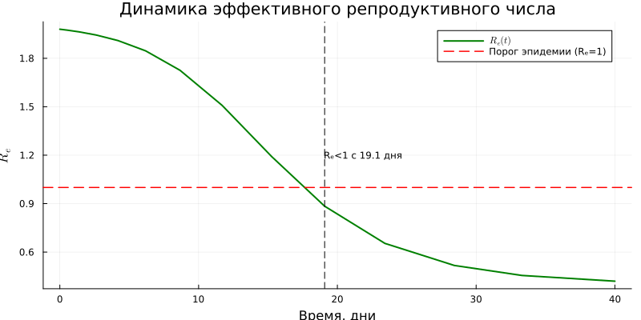
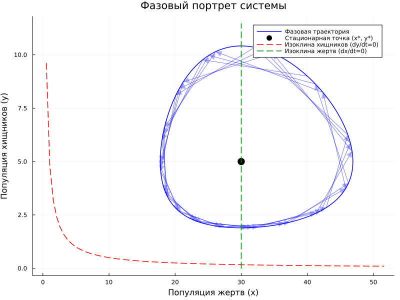
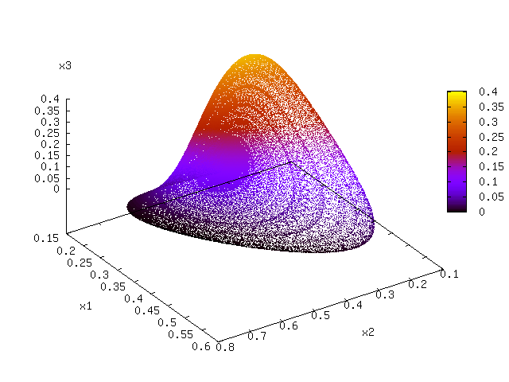

---
## Author
author:
  name: Люпп Софья Романовна
  degrees: BSc
  orcid: 0000-0002-0877-7063
  email: 1132236039@rudn.ru
  affiliation:
    - name: Российский университет дружбы народов
      country: Российская Федерация
      postal-code: 117198
      city: Москва
      address: ул. Миклухо-Маклая, д. 6
## Title
title: Презентация по лабораторной работе №2
subtitle: Модель SIR
license: CC BY
date: today
date-format: "YYYY-MM-DD" # Example: 2025-09-06
---

# Информация

## Докладчик

:::::::::::::: {.columns align=center}
::: {.column width="70%"}

  * Люпп Софья Романовна
  * студентка группы НКНбд-01-23
  * кафедра теории вероятностей и кибербезопасности
  * Российский университет дружбы народов им. П. Лумумбы
  * [1132236039@rudn.ru]
  * <https://github.com/srluipp>

:::
::: {.column width="30%"}

:::
::::::::::::::

# Вводная часть

## Актуальность

Модель SIR (Susceptible‑Infected‑Recovered) остаётся одним из фундаментальных инструментов в эпидемиологии, позволяя оценивать динамику распространения инфекций в популяциях.Модель Лотки–Вольтерра остаётся актуальной, поскольку её простота и гибкость позволяют моделировать динамику взаимодействия популяций в экологических, экономических и эпидемиологических системах, а также интегрировать её с современными данными и машинным обучением.

## Объект и предмет исследования

Обьектами исследования являются модели SIR и Лотки-Вольтерры, а также задачи, которые они решают.

## Цели и задачи

Изучить модель SIR,модель Лотки–Вольтерры, узнать их практическое применение, изучить трехпараметрическую модель и ее практическую ценность.
Задачи:
1) Создать и запустить программный код с моделью SIR;
2) Создать и запустить программный код модели Лотки–Вольтерры;
3) Выполнить практическое задание в конце лабораторной работы.

## Материалы и методы

В качестве материалов к выполнению лабораторной работы была использована работа Имитационное моделирование. Практикум. (А. В. Королькова Кулябов Д. С.)

# Выполнение лабораторной работы

## Динамика эффективного репродуктивного числа

В plots оказались следующие графики: динамика эффективного репродуктивного числа, которая падает к 40 дню ([рис. @fig-004]).

{#fig-004 width=70%}

## Динамика числа зараженных

Динамика числа зараженнных, где пик всех зараженных приходится на 19 день ([рис. @fig-005]).

{#fig-005 width=70%}

## Лог-шкала экспоненциального роста

 ([рис. @fig-006]) .

{#fig-006 width=70%}

## Модель SIR
Сама модель, показывающая динамику восприимчивых, инфицированных и выздоровевших
([рис. @fig-007])

{#fig-007 width=70%}

## График-вывод для всех групп

Далее выводятся все графики для каждой из групп по раздельности ([рис. @fig-008]).

{#fig-008 width=70%}

## Динамика эпидемии

Показательна динамика эпидемии в процентах с порогом коллективного иммунитета в 50% ([рис. @fig-009]).

{#fig-009 width=70%}

## Фазовый портрет модели SIR

Завершаем анализ фазовым портретом модели sir([рис. @fig-010]) .

{#fig-010 width=70%}

## График производной популяции

Далее рассматриваем модель Лотки-Вольтерры: выводим график производных популяций ([рис. @fig-014]).

{#fig-014 width=70%}

## Динамика популяций жертв и хищников

 ([рис. @fig-015]).

{#fig-015 width=70%}

## Графики для каждой популяции

Общий график для каждой популяции, фазовый портрет, скорость изменения и относительные изменения([рис. @fig-016])

{#fig-016 width=70%}

## Фазовый портрет

Фазовый портрет системы со стационарной точкой в 30 жертв и 5 хищников ([рис. @fig-017])

{#fig-017 width=70%}

## Относительные темпы роста по времени

([рис. @fig-018]).

{#fig-018 width=70%}

## Спектральный анализ Фурье 

([рис. @fig-019]) 

{#fig-019 width=70%}

## Результаты

Результатами лабораторной работы явялются представленные графики моделей Лотки-Вольтерры и SIR.

## Итоговый слайд

В результате лабораторной работы я узнала где применимы модели Лотки-Волтерра 

([рис. @fig-033]) 

{#fig-033 width=70%}

## И модель SIR

([рис. @fig-034]) 

{#fig-033 width=70%}
