---
## Author
author:
  name: Люпп Софья Романовна
  degrees: BSc
  orcid: 0000-0002-0877-7063
  email: 1132236039@rudn.ru
  affiliation:
    - name: Российский университет дружбы народов
      country: Российская Федерация
      postal-code: 117198
      city: Москва
      address: ул. Миклухо-Маклая, д. 6

## Title
title: "Лабораторная работа №2"
subtitle: "Модель SIR. Модель Лотки–Вольтерры"
license: "CC BY"
---

# Цель работы

Изучить модель SIR,модель Лотки–Вольтерры, узнать ее практическое применение, изучить трехпараметрическую модель и ее практическую ценность.

# Задание

1) Создать и запустить программный код с моделью SIR;
2) Создать и запустить программный код модели Лотки–Вольтерры;
3) Выполнить практическое задание в конце лабораторной работы.

# Теоретическое введение

Модель SIR делит всю популяцию на три взаимосвязанные группы, что отражено в её названии:
— 𝑆 — Susceptible: люди, которые не болели, не имеют иммунитета и могут заразиться.
— 𝐼 — Infectious: люди, которые в данный момент
больны и могут передавать инфекцию.
— 𝑅 — Recovered: люди, которые переболели и приобрели иммунитет (или умерли).

Основная цель модели: не предсказать судьбу конкретного человека, а понять
общую динамику эпидемии — будет ли она разрастаться, как быстро, сколько
людей в итоге переболеет, как влияют карантинные меры.

Практическое применение модели SIR: обучения основам эпидемиологии, быстрой оценки масштаба угрозы по 𝑅0, прогнозирования нагрузки на систему здравоохранения (пиковое значение 𝐼,оценки эффекта мер: карантин, изоляция, маски снижают параметр 𝛽. 

В классической двухпараметрической модели (𝛽, 𝛾) параметр 𝛽 (коэффициент
заражения) является составным. Он скрывает в себе два процесса: контакт между людьми (поведенческий, управляемый фактор) и передачу инфекции при контакте (биологический фактор).
Трёхпараметрическая модель делает это разделение явным: где 𝑐 — среднее число контактов (достаточно тесных для передачи инфекции)
одного человека в единицу времени, 𝛽 — вероятность передачи инфекции при одном контакте между заразным и
восприимчивым (безразмерная величина, от 0 до 1) и 𝛾 — скорость выздоровления (доля инфицированных, выздоравливающих в единицу времени). Как и раньше, 1/𝛾 — средняя продолжительность заразного периода.

Практическая ценность трёхпараметрической формы заключается в планировании мер: позволяет оценить эффективность разных стратегий, а также она более нашлядна для неспециалистов.

Модель Лотки-Вольтерры — это фундаментальная математическая модель в экологии, описывающая динамику взаимодействия двух видов: хищников и жертв.

Модель демонстрирует, как даже простая система взаимодействий может порождать сложные колебательные режимы, объясняя циклические изменения численности в природных экосистемах.

# Выполнение лабораторной работы

Начинаю с изучения теории по модели SIR. Далее необходимо создать новый файл sir_ode с кодом для анализа результатов общей численности популяции, пикового числа зараженных, времени достижения пика, итогового числа и доли переболевших ([рис. @fig-001]) ([рис. @fig-002]) ([рис. @fig-003]).

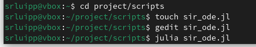{#fig-001 width=70%}

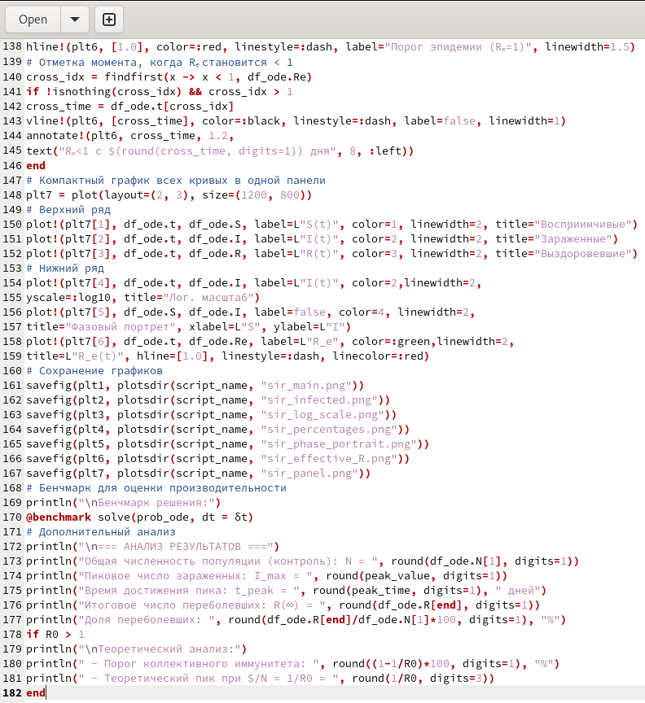{#fig-002 width=70%}

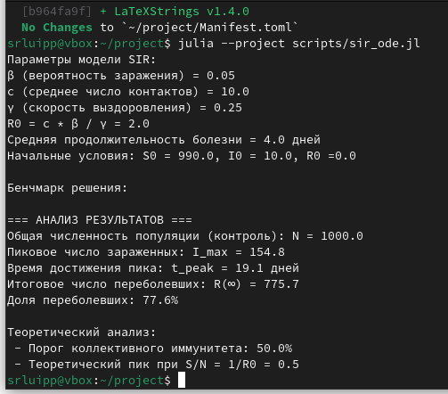{#fig-003 width=70%}

В plots оказались следующие графики: динамика эффективного репродуктивного числа, которая падает к 40 дню ([рис. @fig-004]).

{#fig-004 width=70%}

Динамика числа зараженнных, где пик всех зараженных приходится на 19 день ([рис. @fig-005]).

{#fig-005 width=70%}

Следующий график - лог-шкала экспоненциального роста, и сама модель sir, показывающая динамику восприимчивых, инфицированных и выздоровевших ([рис. @fig-006]) ([рис. @fig-007]).

{#fig-006 width=70%}

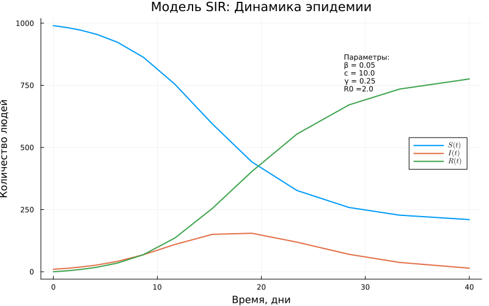{#fig-007 width=70%}

Далее выводятся все графики для каждой из групп по раздельности ([рис. @fig-008]).

{#fig-008 width=70%}

Показательна динамика эпидемии в процентах с порогом коллективного иммунитета в 50% ([рис. @fig-009]).

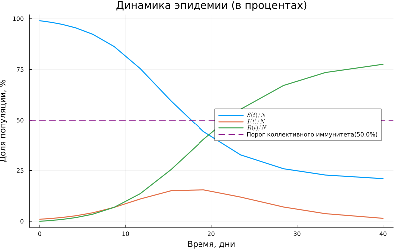{#fig-009 width=70%}

Завершаем анализ фазовым портретом модели sir([рис. @fig-010]) .

{#fig-010 width=70%}

Создаем новый файл lv_ode для модели Лотки–Вольтерры, описывающей динамику взаимодействия двух видов: хищников и жертв ([рис. @fig-011]).

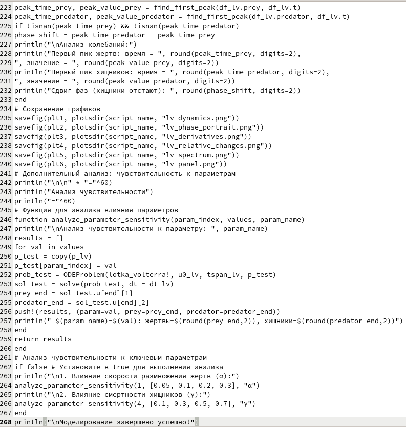{#fig-011 width=70%}

Вывод анализа кода ([рис. @fig-012]) ([рис. @fig-013]).

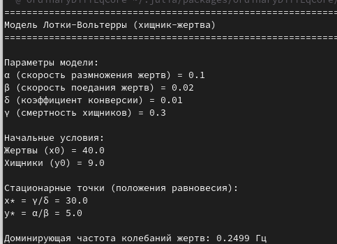{#fig-012 width=70%}

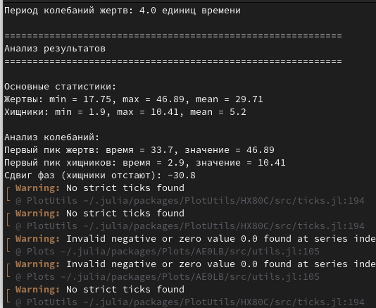{#fig-013 width=70%}

В plots находим следущие графики: производные популяций ([рис. @fig-014]).

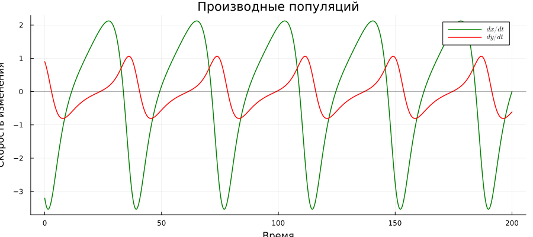{#fig-014 width=70%}

Динамику популяций жертв и хищников ([рис. @fig-015]).

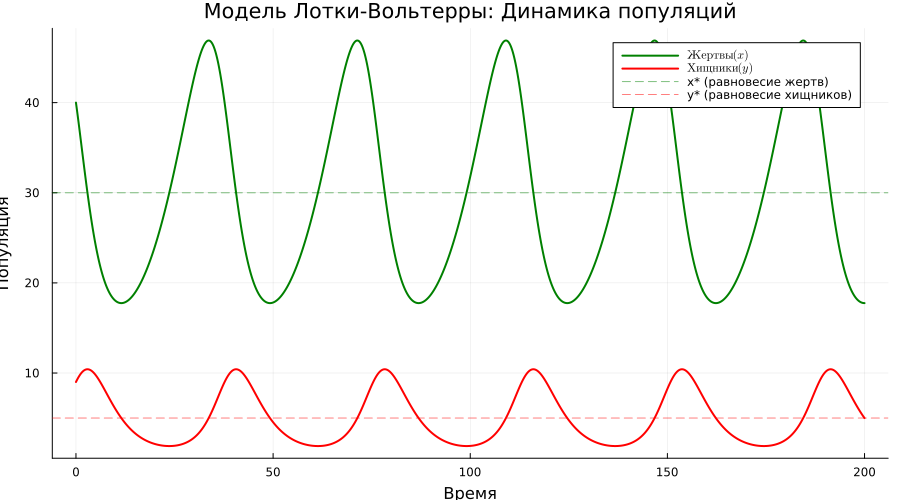{#fig-015 width=70%}

Общий график для каждой популяции, фазовый портрет, скорость изменения и относительные изменения([рис. @fig-016])

{#fig-016 width=70%}

Фазовый портрет системы со стационарной точкой в 30 жертв и 5 хищников ([рис. @fig-017])

{#fig-017 width=70%}

Относительные темпы роста по времени ([рис. @fig-018]).

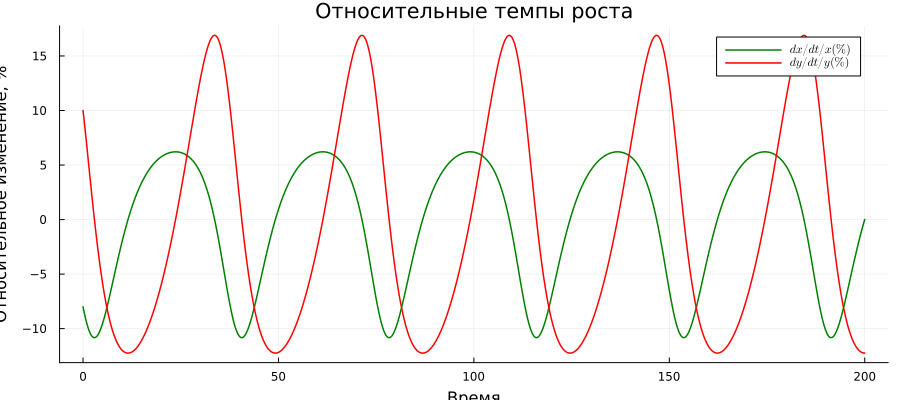{#fig-018 width=70%}

И спектральный анализ Фурье ([рис. @fig-019]) 

{#fig-019 width=70%}

Создаю tangle файл для форматов quarto и jupiter notebook ([рис. @fig-020]).

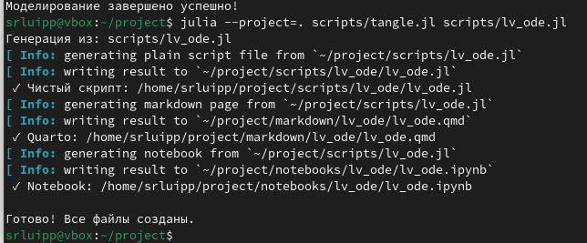{#fig-020 width=70%}

Открываю рабочий лист в jupiter notebook lv_ode([рис. @fig-021]).

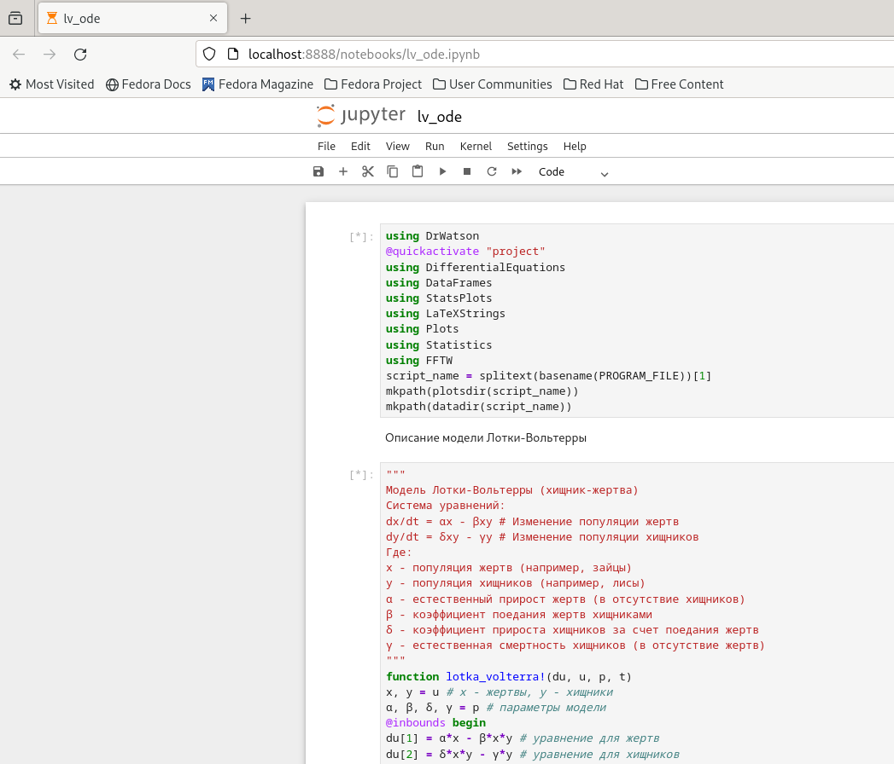{#fig-021 width=70%}

Некоторые выводы в блокноте jupiter notebook ([рис. @fig-022]) ([рис. @fig-023]) ([рис. @fig-024])  ([рис. @fig-025]) ([рис. @fig-026]).

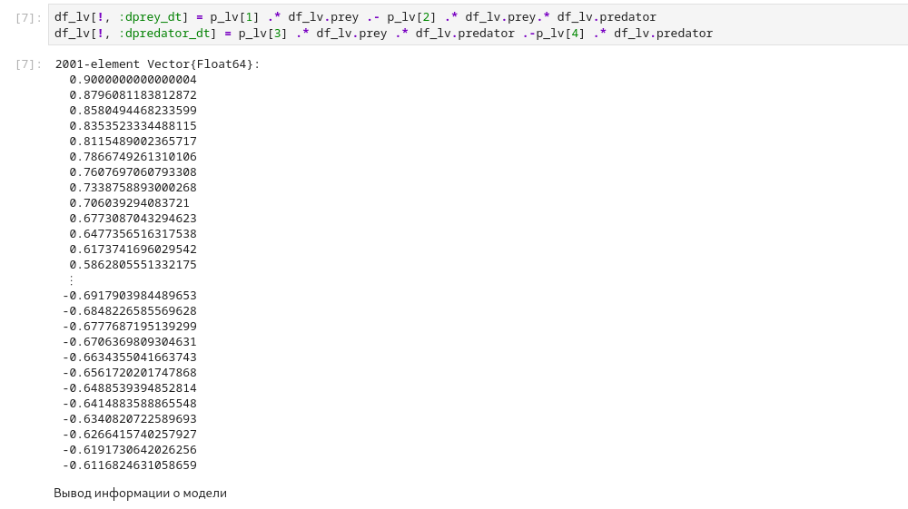{#fig-022 width=70%}

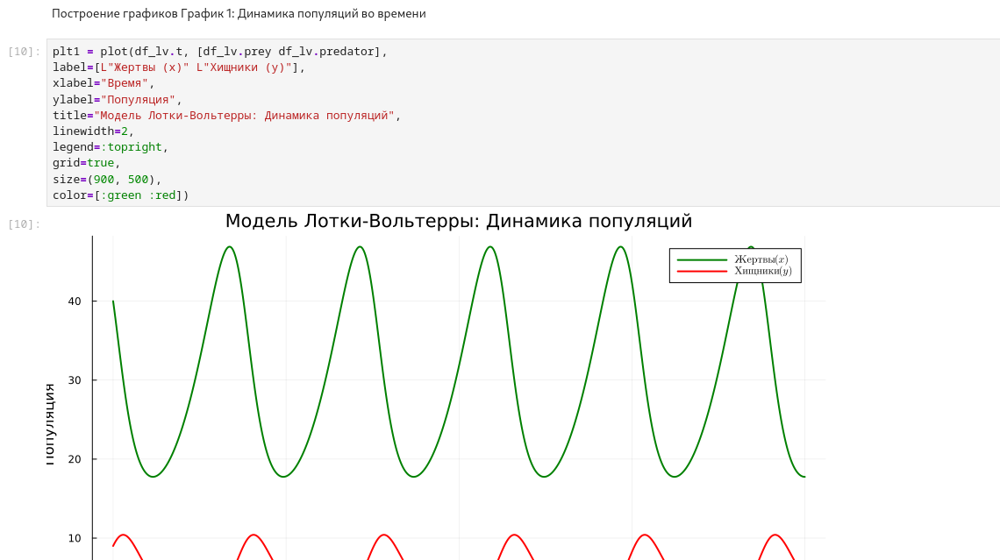{#fig-023 width=70%}

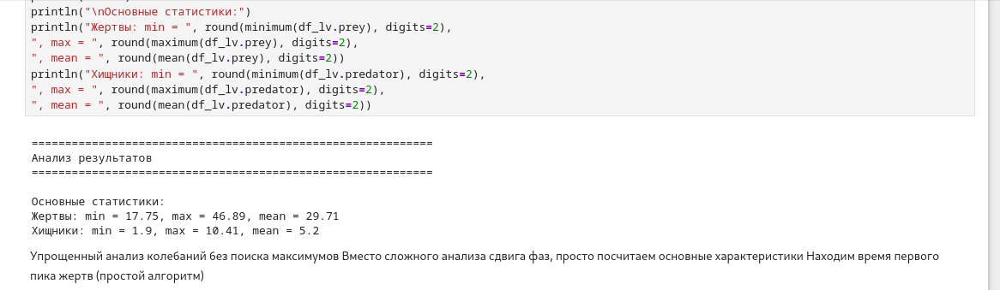{#fig-024 width=70%}

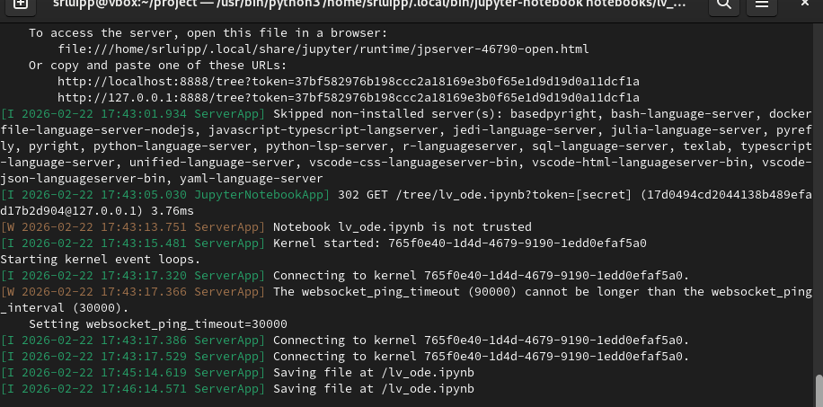{#fig-025 width=70%}

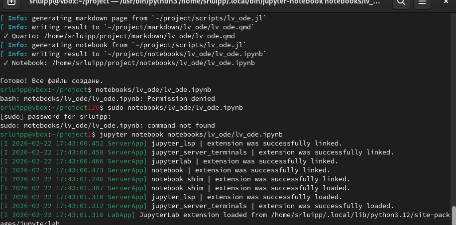{#fig-026 width=70%}

Также делаю формат tangle для файла sir_ode ([рис. @fig-027]) ([рис. @fig-028]).

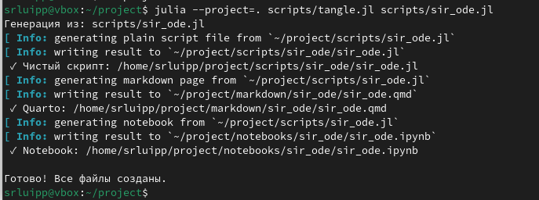{#fig-027 width=70%}

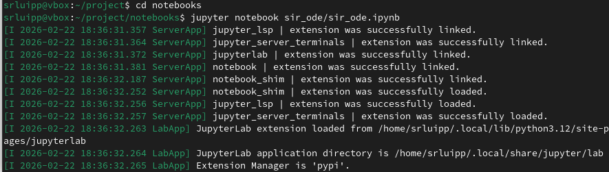{#fig-028 width=70%}

Вывожу файл sir_ode в jupiter notebook ([рис. @fig-029]).

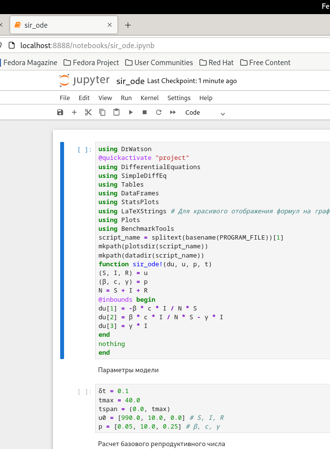{#fig-029 width=70%}

Добавила в преамбуле preamble.tex пакет juliamono. В каталоге отчёта в файл _quarto.yml включила поддержку кода julia. Добавила после описания проекта ([рис. @fig-030]) ([рис. @fig-031]) ([рис. @fig-032]).

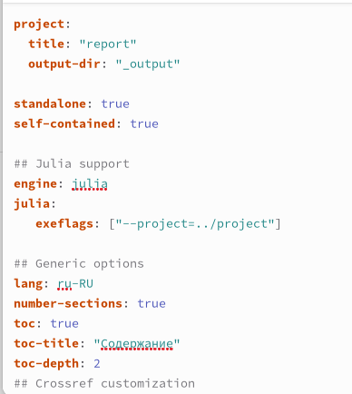{#fig-030 width=70%}

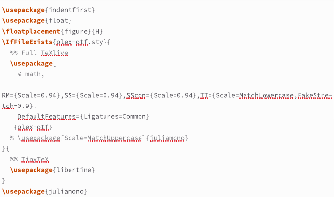{#fig-031 width=70%}

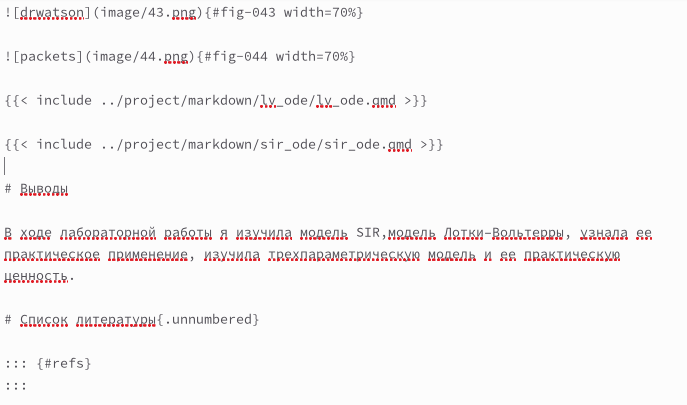{#fig-032 width=70%}





# Выводы

В ходе лабораторной работы я изучила модель SIR,модель Лотки–Вольтерры, узнала ее практическое применение, изучила трехпараметрическую модель и ее практическую ценность.

# Список литературы{.unnumbered}

::: {#refs}
:::
