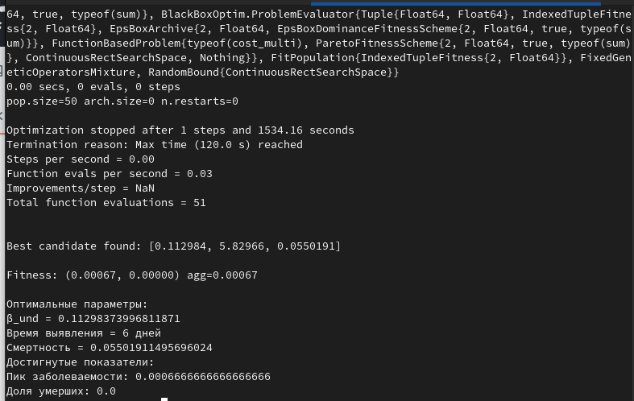
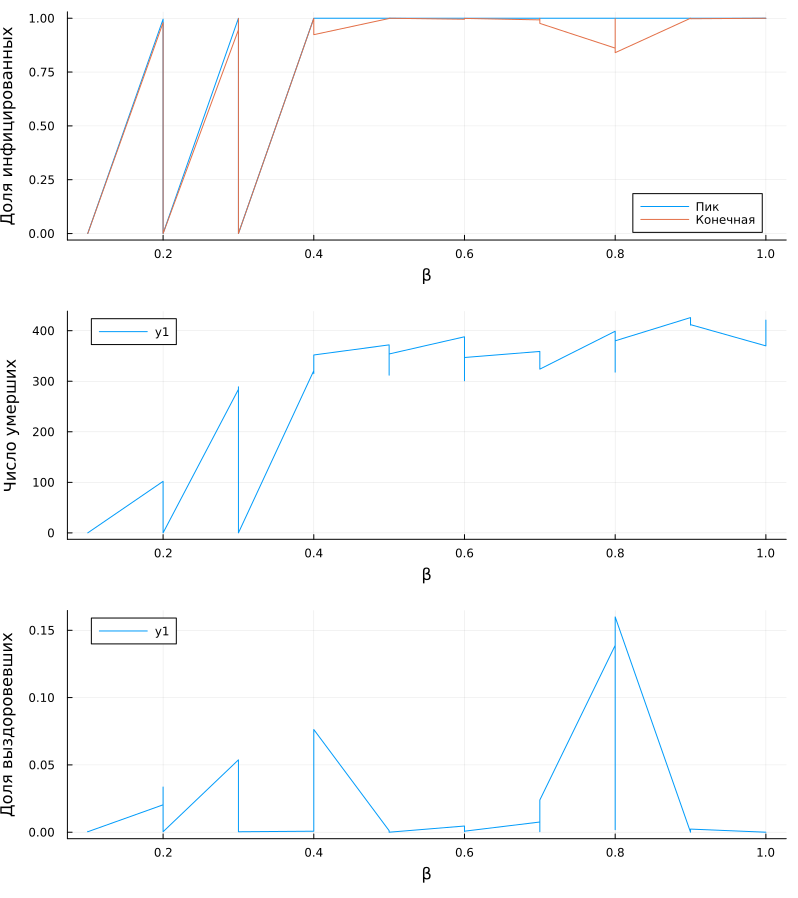

---
## Author
author:
  name: Люпп Софья Романовна
  degrees: Bachelor's
  orcid: 0000-0002-0877-7063
  email: 1132236039@rudn.ru
  affiliation:
    - name: Российский университет дружбы народов
      country: Российская Федерация
      postal-code: 117198
      city: Москва
      address: ул. Миклухо-Маклая, д. 6
## Title
title: Презентация по лабораторной работе №4
subtitle: Реализация основных моделей в агентном подходе
license: CC BY
date: today
date-format: "YYYY-MM-DD" # Example: 2025-09-06
---

# Информация

## Докладчик

:::::::::::::: {.columns align=center}
::: {.column width="70%"}

  * Люпп Софья Романовна
  * стундентка группы НКНбд-01-23
  * кафедра теории вероятностей и кибербезопасности
  * Российский университет дружбы народов им. П. Лумумбы
  * 1132236039@rudn.ru
  * <https://github.com/srluipp>

:::
::: {.column width="30%"}

:::
::::::::::::::

# Вводная часть

## Актуальность

Модель SIR остаётся одним из фундаментальных инструментов в эпидемиологии, позволяя оценивать динамику распространения инфекций в популяциях.

## Объект и предмет исследования

Объектом исследования является агентный подход. Предметом исследования является модель SIR

## Цели 

Изучить модель SIR, применить агентный подход к моделированию

## Задачи

1) Создать и запустить программный код скриптов с описанием модели SIR;
2) Выполнить практическое задание в конце лабораторной работы.
3) Оформить документацию в формате Quarto, преобразовать в литературный стиль.

## Материалы и методы

В качестве материалов к выполнению лабораторной работы была использована работа Имитационное моделирование. Практикум. (А. В. Королькова Кулябов Д. С.)

# Выполнение лабораторной работы

## Статистика по SIR

На графике выведена статистика по всем группам модели - восприимчивые, инфицированные и выздоровевшие. Так же на графике представлена и статистика общего количества людей в течение 100 дней ([рис. @fig-007])

{#fig-007 width=70%}

## Доля инфицированных

На графике представлена доля инфецированных людей в зависимости от коэффициента заразности, отмечая пик эпидемии, конечную долю инфицированных и долю умерших([рис. @fig-009]).

{#fig-009 width=70%}

## Влияние миграции на скорость распространение инфекции 

На графике показываем, как интенсивность перемещения людей между городами влияет на
скорость распространения эпидемии и масштаб пика, при условии, что инфекция начинается только в одном городе, а остальные изначально здоровы ([рис. @fig-011])

{#fig-011 width=70%}

## Оптимальные параметры

Получаем вывод в консоль об оптимальных параметрах, минимизирующих пиковую заболеваемость и долю умерших. Среди них: время выявление, смертность, порог бета и другие. ([рис. @fig-015]).

{#fig-015 width=70%}

## Сводный график

Выводим общий график для всех групп - инфициронных, умерших и выздоровевших от интенсивности заражения бета ([рис. @fig-016]).

{#fig-016 width=70%}

## 

##

## 

## 

## 

## Результаты

Результатами лабораторной работы явялются представленные графики модели SIR.

## Итоговый слайд

В результате лабораторной работы я изучила агентный подход к моделированию и поработала с моделью SIR

([рис. @fig-023]) 

{#fig-033 width=70%}

:::
