---
## Author
author:
  name: Люпп Софья Романовна
  degrees: Bachelor's
  orcid: 0000-0002-0877-7063
  email: 1132236039@rudn.ru
  affiliation:
    - name: Российский университет дружбы народов
      country: Российская Федерация
      postal-code: 117198
      city: Москва
      address: ул. Миклухо-Маклая, д. 6

## Title
title: "Лабораторная работа №4"
subtitle: "Реализация основных моделей в агентном подходе"
license: "CC BY"
---

# Цель работы

Целью лабораторной работы является знакомство с агентным подходом и реализация основных моделей в агентном подходе на примере модели SIR.

# Задание

1. Написать скрипты для модели SIR;
2. Запустите модель с параметрами по умолчанию, определив базовое репродуктивное число R₀;
3. Исследовать минимальное значение 𝛽, при котором возникает эпидемия и сравнить с теоретическим порогом;
4. Реализовать эффект гетерогенности, задав разные значения 𝛽 для разных городов;
5. Исследовать влияние интенсивности миграции на скорость распространения инфекции из одного города в другие;
6. Модифицировать модель, добавив возможность закрытия города (обнуление миграции из него) при превышении порога заболеваемости;
7. Используя оптимизацию, найти параметры, которые минимизируют общее число умерших при сохранении пика заболеваемости ниже 30%.
8. Интегрировать документацию с параметрами в формате Quarto в отчёт.

# Теоретическое введение

Модель SIR, предложенная Кермаком и Маккендриком в 1927 году, описывает
динамику эпидемии в популяции, разделённой на три группы:
— 𝑆 (Susceptible) — восприимчивые к заболеванию индивиды;
— 𝐼 (Infectious) — инфицированные, способные заражать восприимчивых;
— 𝑅 (Recovered) — выздоровевшие (или умершие).

Агентное моделирование позволяет преодолеть эти ограничения:
— Каждый индивид моделируется отдельно с уникальными характеристиками.
— Взаимодействия происходят локально в пространстве или социальной сети.
— Процессы носят стохастический характер.
— Можно учитывать гетерогенность контактов, мобильность, меры контроля.

Параметрами для нашей модели будут:
— Ns — вектор численности населения по локациям;
— β_und — вероятность передачи для невыявленных случаев;
— β_det — вероятность передачи для выявленных случаев;
— infection_period — длительность заболевания (дней);
— detection_time — время до выявления заболевания;
— death_rate — вероятность летального исхода;
— reinfection_probability — вероятность повторного заражения;
— migration_rates — матрица вероятностей миграции между локациями.

На каждом шаге (соответствует одному дню) для каждого агента выполняются следующие процессы :
— Миграция — агент может переместиться в другую локацию с вероятностью, заданной матрицей migration_rates.
— Передача инфекции — если агент инфицирован, он может заразить восприимчивых агентов в той же локации. Количество заражённых за день определяется
пуассоновским процессом с интенсивностью, зависящей от статуса выявления
(β_und или β_det).
— Обновление счётчика — для инфицированных увеличивается days_infected.
— Выздоровление или смерть — если days_infected достиг infection_period,
агент либо выздоравливает (переходит в R), либо умирает (удаляется из модели)
с вероятностью death_rate. Выздоровевшие могут быть повторно инфицированы с вероятностью reinfection_probability.

# Выполнение лабораторной работы

Начинаю выполнение лабораторной работы с создания новых файлов-скриптов. Начинаю с описания модели - sir_model.jl в папку scr, именно на основе него будут работать остальные скрипты ([рис. @fig-001]).

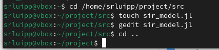{#fig-001 width=70%}

Далее пишу скрипт sir_run_basic.jl в scripts, как и затем все остальные скрипты тоже. Файл запускает один эксперимент с фиксированными параметрами и сохраняет динамику численности агентов. Это служит для проверки работоспособности модели и получения базового понимания эпидемического процесса ([рис. @fig-002]) .

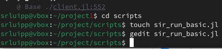{#fig-002 width=70%}

Создаю новый файл sir_scan_beta.jl - файл исследует, как изменение базовой заразности (β_und и пропорционально β_det) влияет на эпидемические показатели: пик заболеваемости, долю переболевших, число умерших. Выполняется параметрическое сканирование с несколькими повторными прогонами для учёта стохастичности ([рис. @fig-003]).

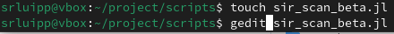{#fig-003 width=70%}

Заполняю код для файла sir_migration_effect.jl, который исследует, как интенсивность перемещения людей между городами влияет на скорость распространения эпидемии (время достижения пика) и масштаб пика. Инфекция начинается только в одном городе, остальные изначально здоровы ([рис. @fig-004]).

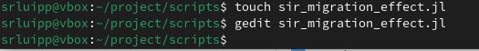{#fig-004 width=70%}

Создаю скрипт sir_optimize_parameters.jl и sir_visualize_dynamics.jl. Первый ищет оптимальные комбинации параметров, минимизирующие одновременно два критерия: пиковую заболеваемость и долю умерших. Использует эволюционный алгоритм (Borg MOEA) из пакета BlackBoxOptim, второй - загружает результаты параметрического сканирования и строит единый составной график, объединяющий три панели:
— пик эпидемии и конечная доля инфицированных;
— число умерших;
— доля выздоровевших([рис. @fig-005]).

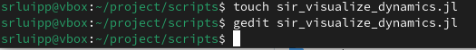{#fig-005 width=70%}

Для скрипта необходим пакет из Julia - Distributions ([рис. @fig-006]).

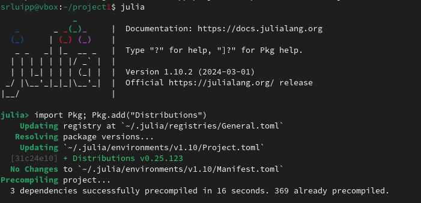{#fig-006 width=70%}

Начинаю запускать через Julia получившиеся файлы: ([рис. @fig-007]) ([рис. @fig-008]).

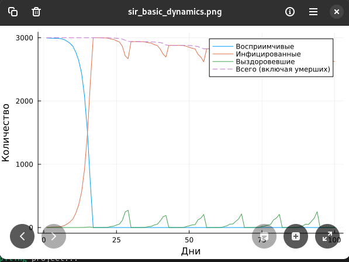{#fig-007 width=70%}

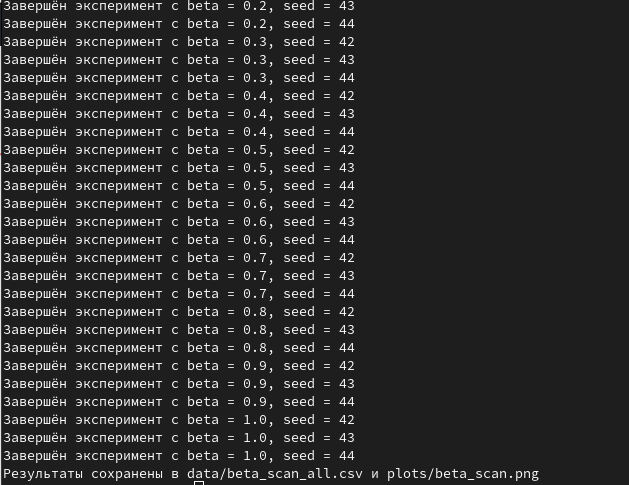{#fig-008 width=70%}

 ([рис. @fig-009]).

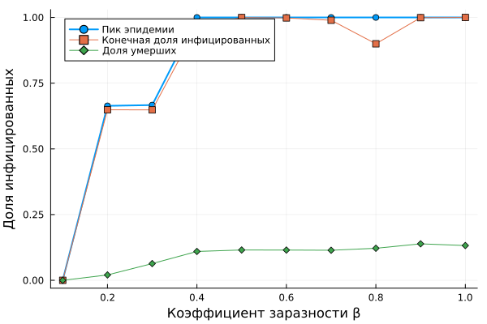{#fig-009 width=70%}

Проводятся эксперименты с миграцией ([рис. @fig-010]) ([рис. @fig-011]).

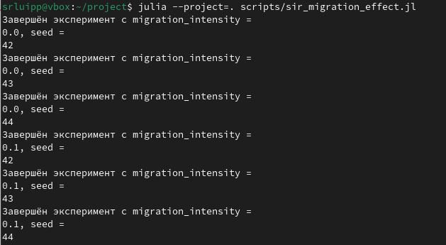{#fig-010 width=70%}

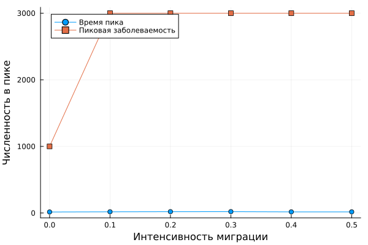{#fig-011 width=70%}

В формате cvs сохранились результаты экспериментов файлов с миграцией и числом бета ([рис. @fig-012]) ([рис. @fig-013]).

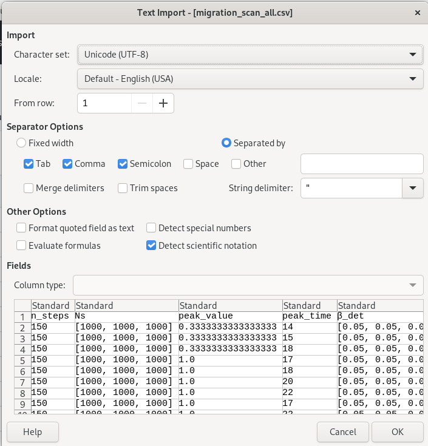{#fig-012 width=70%}

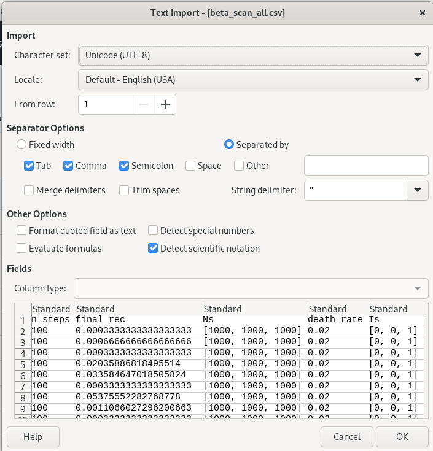{#fig-013 width=70%}

Для сводного графика sir_visualize_dynamics.jl устанавливаем нужный пакет из Julia ([рис. @fig-014]).

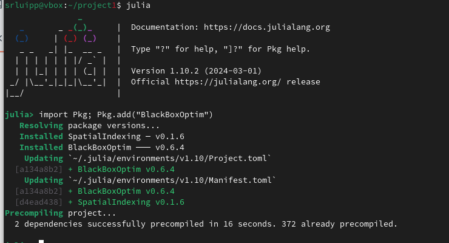{#fig-014 width=70%}

На выходе получаем некоторые найденные параметры в консоль и общий сводный график ([рис. @fig-015]) ([рис. @fig-016]).

{#fig-015 width=70%}

{#fig-016 width=70%}

Далее выполняю домашную работу - создаю новый файл в котором опишу все здания - homework.jl. Получаю графики в plots и некоторые найденные результаты в консоль ([рис. @fig-017]) ([рис. @fig-018]) ([рис. @fig-019]) ([рис. @fig-020]) ([рис. @fig-021]) ([рис. @fig-022]).
 
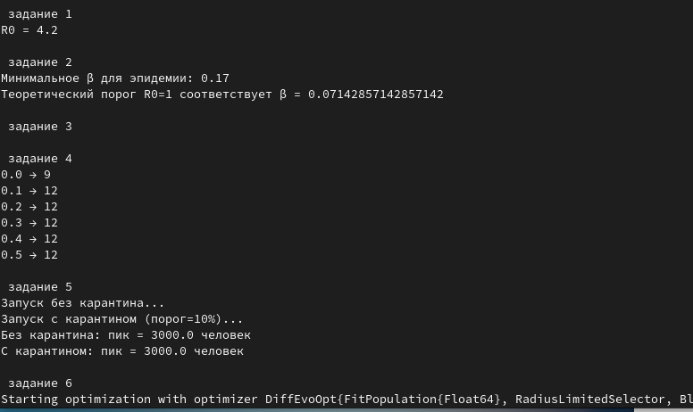{#fig-017 width=70%}

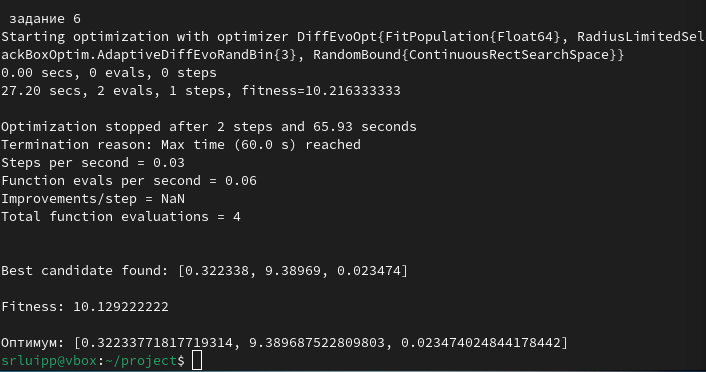{#fig-018 width=70%}

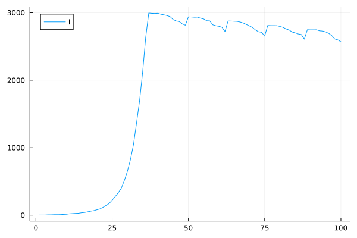{#fig-019 width=70%}

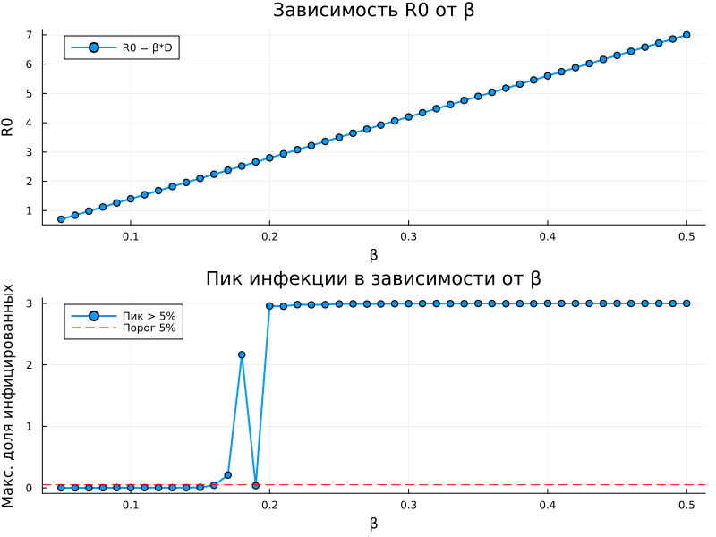{#fig-020 width=70%}

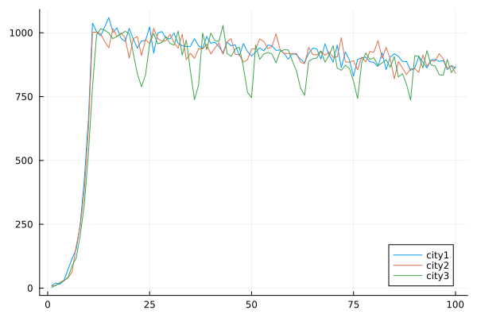{#fig-021 width=70%}

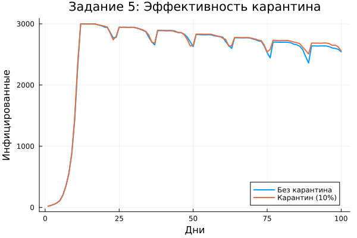{#fig-022 width=70%}






# Выводы

В ходе проделанной работы ознакомилась с агентным подходом и реализацией основных моделей в агентном подходе на примере модели SIR.

# Список литературы{.unnumbered}

- Имитационное моделирование. Практикум
А. В. Королькова Кулябов Д. С.

::: {#refs}
:::
