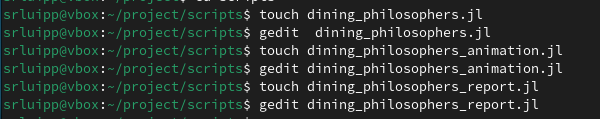
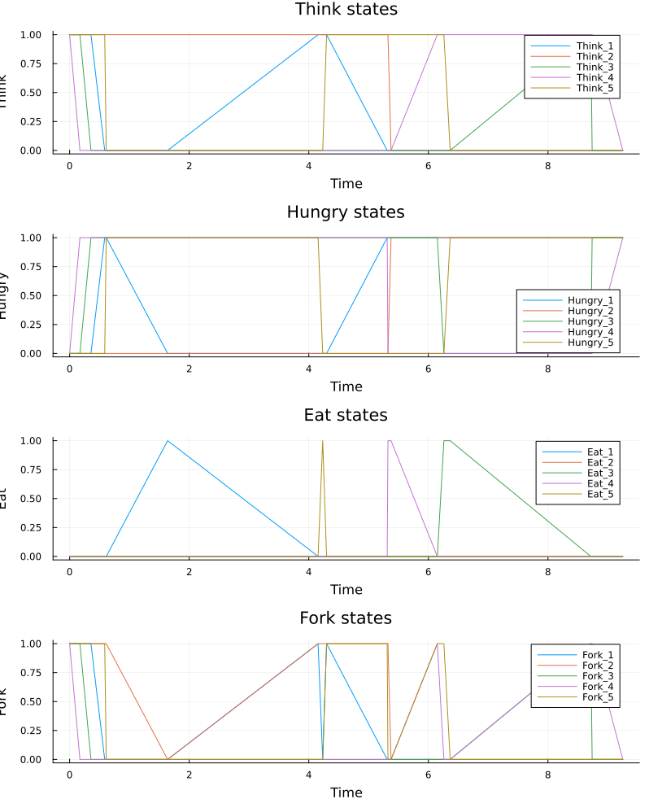
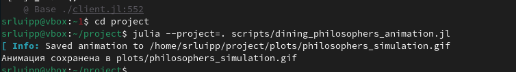

---
## Author
author:
  name: Люпп Софья Романовна
  degrees: Bachelor's
  orcid: 0000-0002-0877-7063
  email: kulyabov-ds@rudn.ru
  affiliation:
    - name: Российский университет дружбы народов
      country: Российская Федерация
      postal-code: 117198
      city: Москва
      address: ул. Миклухо-Маклая, д. 6
## Title
title: Презентация по лабораторной работе №5
subtitle: Аппарат сетей Петри
license: CC BY
date: today
date-format: "YYYY-MM-DD" # Example: 2025-09-06
---

# Информация

## Докладчик

:::::::::::::: {.columns align=center}
::: {.column width="70%"}

  * Люпп Софья Романовна
  * студентка НКНбд-01-23
  * кафедра теории вероятностей и кибербезопасности
  * Российский университет дружбы народов им. П. Лумумбы
  * 1132236039@rudn.ru
  * <https://github.com/srluipp>

:::
::: {.column width="30%"}

:::
::::::::::::::

# Вводная часть

## Актуальность

Аппарат сетей Петри применяется в промышленности и производстве, в информационных технологиях, бизнес-процессах, биологиии, медицине. Теория сетей Петри, появившаяся как инструмент для анализа химических процессов, сегодня является мощным и наглядным математическим аппаратом.

## Объект и предмет исследования

Объект исследования: аппарат сетей Петри
Предмет исследования: задача обедающих философов

## Цели 

Изучить аппарат сетей Петри

## Задачи

1) Изучить теорию по аппарату сетей Петри;
2) Создать необходимые скрипты по заданию;
3) Выполнить отчет и презентацию, преобразовать документацию в формате Quarto и выполнить литературный код.

## Материалы и методы

В качестве материалов к выполнению лабораторной работы была использована работа Имитационное моделирование. Практикум. (А. В. Королькова Кулябов Д. С.)

# DiningPhilosophers

Начинаю лабораторную с главного скрипта, где будет описана модель обедающих философов Dining_philosophers в src ([рис. @fig-001]).

{#fig-001 width=70%}

## Dining_philosophers.jl

Создаю скрипт, который выполняет основное моделирование и сравнение двух вариантов сети
Петри dining_philosophers.jl, скрипт dining_philosophers_animation.jl, который создает анимацию для наглядной демонстрации динамики работы сети Петри во времени и скрипт dining_philosophers_report.jl, сравнительно анализирующий две модели (с арбитром и без) по ключевому показателю Eat_i ([рис. @fig-002]).

{#fig-002 width=70%}

## График classic_simulation
 
В plots появился график classic_simulation. В классической модели для задачи обедающих философов без арбитра вдет к взаимной блокировке  detect_deadlock - true (([рис. @fig-007])
 
{#fig-007 width=70%}

## График arbiter_simulation

В plots появился график arbiter_simulation - это модель с арбитром  (дополнительная позиция с N-1 фишками), которая избегает блокировки и возвращает false detect_deadlock ([рис. @fig-004]) 

{#fig-004 width=70%}

## dining_philosophers_animation.jl

Выполняю команду julia для скрипта dining_philosophers_animation.jl ([рис. @fig-005]). На выходе получается анимация, которая позволяет увидеть, как меняется маркировка в каждой позиции, и особенно наглядно показывает возникновение deadlock в классической модели.

{#fig-005 width=70%}

## final_report

Делаю вывод общего графика сравнительного анализа двух моделей, с арбитром и без ([рис. @fig-008]).

{#fig-008 width=70%}

## Результаты

Результатами данной лабораторной работы являются получившиеся графики и анимация в plots

## Итоговый слайд

([рис. @fig-009]).

{#fig-009 width=70%}

:::
