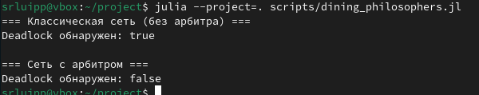
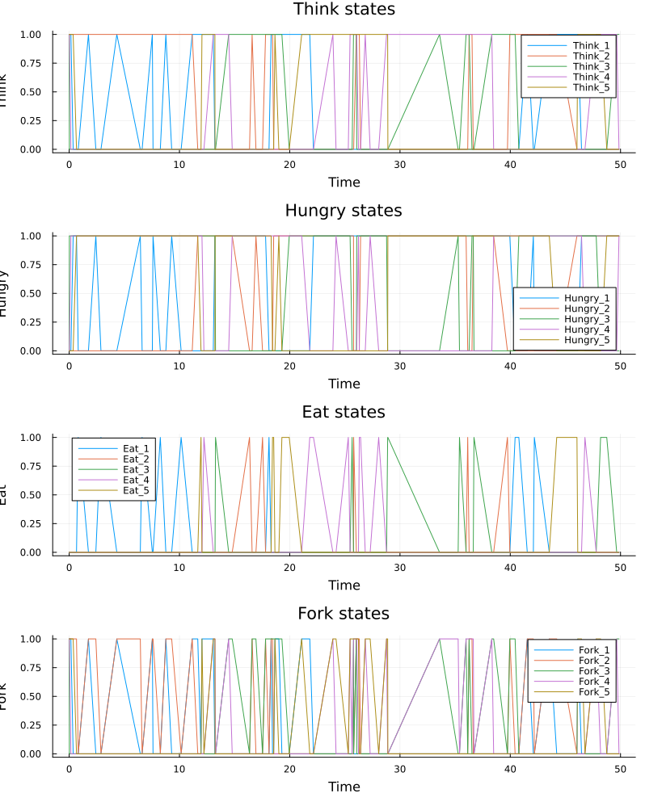
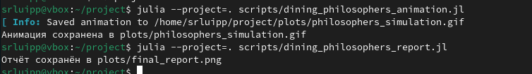
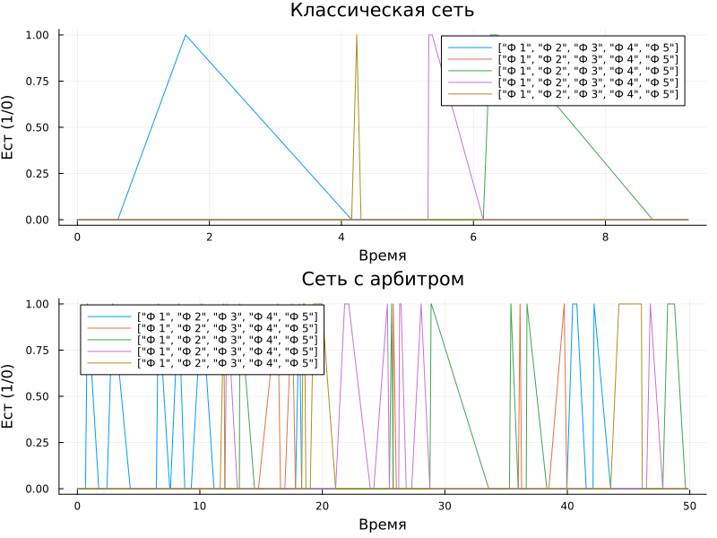

---
## Author
author:
  name: Люпп Софья Романовна
  degrees: Bachelor's
  orcid: 0000-0002-0877-7063
  email: 1132236039@rudn.ru
  affiliation:
    - name: Российский университет дружбы народов
      country: Российская Федерация
      postal-code: 117198
      city: Москва
      address: ул. Миклухо-Маклая, д. 6

## Title
title: "Лабораторная работа №5"
subtitle: "Аппарат сетей Петри"
license: "CC BY"
---

# Цель работы

Изучить аппарат сетей Петри

# Задание

1) Изучить теорию по аппарату сетей Петри;
2) Создать необходимые скрипты по заданию;
3) Выполнить отчет и презентацию, преобразовать документацию в формате Quarto и выполнить литературный код.

# Теоретическое введение

Сеть Петри есть математический аппарат для моделирования дискретных систем.
Графически она представляется как двудольный ориентированный граф двух
типов вершин: позиции (круги) и переходы (прямоугольники).

Теория сетей Петри, появившаяся как инструмент для анализа химических процессов, сегодня является мощным и наглядным математическим аппаратом. Она
незаменима везде, где нужно описать параллельные, асинхронные и распределённые системы. В её основе лежат всего четыре элемента, а богатство поведения
возникает из их комбинации.

В основе сети Петри лежит двудольный ориентированный мультиграф — это означает, что вершины в ней делятся на два типа, дуги всегда соединяют вершины
разных типов, и между двумя вершинами может быть несколько дуг.

Сеть Петри (N-схема) — это четвёрка:
𝑁 = (𝑃, 𝑇, 𝐹, 𝑀0), где:
— 𝑃 = 𝑝1, 𝑝2, ..., 𝑝𝑛 — конечное множество позиций (мест);
— 𝑇 = 𝑡1, 𝑡2, ..., 𝑡𝑚 — конечное множество переходов;
— 𝐹 ⊆ (𝑃 × 𝑇 ) ∪ (𝑇 × 𝑃) — множество дуг (отношения инцидентности);
— 𝑀0 ∶ 𝑃 → ℕ — маркировка, задающая начальное распределение фишек.

Области применения сетей Петри:
— Промышленность и производство. Моделирование гибких производственных
линий, роботизированных ячеек, логистических цепочек.
— Информационные технологии. Моделирование распределённых баз данных,
протоколов связи, параллельных алгоритмов и многопоточных программ.
— Бизнес-процессы. Описание и анализ workflow, документооборота, согласования заявок.
— Биология и медицина. Моделирование биохимических реакций, распространения эпидемий, работы медицинских систем.

# Выполнение лабораторной работы

 Начинаю лабораторную с главного скрипта, где будет описана модель обедающих философов Dining_philosophers в src ([рис. @fig-001]).

{#fig-001 width=70%}

Создаю скрипты, которые: выполняют основное моделирование и сравнение двух вариантов сети
Петри (dining_philosophers.jl), создают анимацию для наглядной демонстрации динамики работы сети Петри во времени (dining_philosophers_animation.jl) и сравнительно анализируют две модели (с арбитром и без) по одному ключевому показателю — числу философов, находящихся в состоянии «Ест» (Eat_i) (скрипт dining_philosophers_report.jl) ([рис. @fig-002]).

{#fig-002 width=70%}

Выполняю команду julia для скрипта dining_philosophers.jl ([рис. @fig-003]).

{#fig-003 width=70%}

В plots возвращаются следующие графики ([рис. @fig-004]) ([рис. @fig-008]).

{#fig-004 width=70%}

{#fig-007 width=70%}

Выполняю команду julia для скрипта dining_philosophers_animation.jl ([рис. @fig-005]).

{#fig-005 width=70%}

Выпооняют команду julia для скрипта dining_philosophers_report.jl ([рис. @fig-006]). На выходе получается анимация, которая позволяет увидеть, как меняется маркировка (фишки) в каждой позиции, и особенно наглядно показывает возникновение deadlock в классической модели.

{#fig-006 width=70%}

Вывод общего графика сравнительного анализа двух моделей, с арбитром и без ([рис. @fig-008]).

{#fig-008 width=70%}





# Выводы

В ходе лабораторной работы я изучила аппарат сетей Петри и сделала модель обедающих философов

# Список литературы{.unnumbered}

- Имитационное моделирование. Практикум
А. В. Королькова Кулябов Д. С.

::: {#refs}
:::
