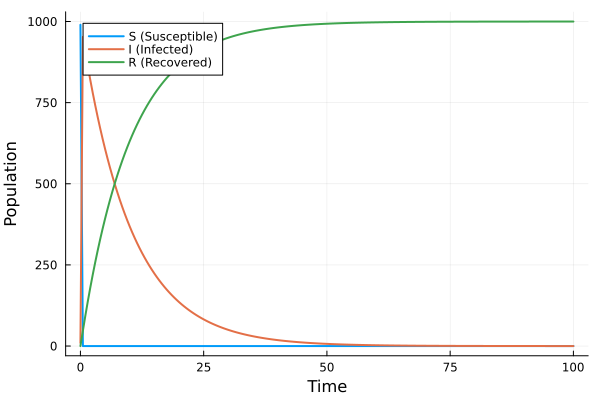
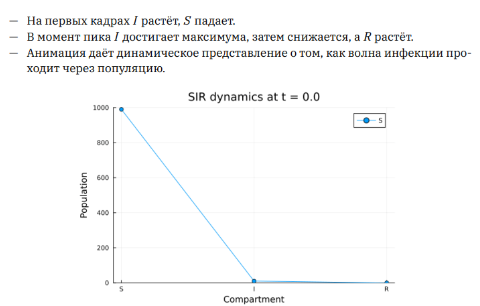
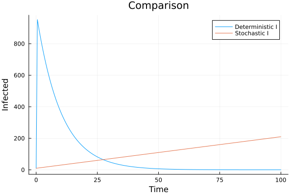

---
## Author
author:
  name: Люпп Софья Романовна
  degrees: Bachelor's
  orcid: 0000-0002-0877-7063
  email: 1132236039@rudn.ru
  affiliation:
    - name: Российский университет дружбы народов
      country: Российская Федерация
      postal-code: 117198
      city: Москва
      address: ул. Миклухо-Маклая, д. 6
## Title
title: Презентация по лабораторной работе №6
subtitle: Реализация основных моделей в подходе сетей Петри
license: CC BY
date: today
date-format: "YYYY-MM-DD" # Example: 2025-09-06
---

# Информация

## Докладчик

:::::::::::::: {.columns align=center}
::: {.column width="70%"}

  * Люпп Софья Романовна
  * студентка НКНбд-01-23
  * кафедра теории вероятностей и кибербезопасности
  * Российский университет дружбы народов им. П. Лумумбы
  * 1132236039@rudn.ru
  * <https://github.com/srluipp>

:::
::: {.column width="30%"}

:::
::::::::::::::

# Вводная часть

## Актуальность

Аппарат сетей Петри применяется в промышленности и производстве, в информационных технологиях, бизнес-процессах, биологиии, медицине. Теория сетей Петри, появившаяся как инструмент для анализа химических процессов, сегодня является мощным и наглядным математическим аппаратом.

## Объект и предмет исследования

Объект исследования: аппарат сетей Петри
Предмет исследования: сами модели Петри

## Цели 

Изучить аппарат сетей Петри

## Задачи

1) Изучить теорию по аппарату сетей Петри;
2) Создать необходимые скрипты по заданию;
3) Выполнить отчет и презентацию, преобразовать документацию в формате Quarto и выполнить литературный код.

## Материалы и методы

В качестве материалов к выполнению лабораторной работы была использована работа Имитационное моделирование. Практикум. (А. В. Королькова Кулябов Д. С.)

# Создание презентации

## sirpetri_run.jl

Создаю скрипт sirpetri_run.jl, который выполняет один базовый эксперимент с фиксированными параметрами β = 0.3, γ = 0.1, sirpetri_scan_parameters.jl и другие скрипты ([рис. @fig-006])

{#fig-002 width=70%}

## sirpetri_run.jl

Получили динамику эпидемии модели SIR для всех групп ([рис. @fig-005]).

{#fig-005 width=70%}

## sirpetri_scan_parameters.jl

Получаем график с двумя линиями: пик I(β) и конечное R(β), где исследуется чувствительность модели к изменению параметра β ([рис. @fig-006])

{#fig-006 width=70%}

## Анимация

Также в plot сохранилась анимация в формате gif, показывающая, как со временем меняется количество людей в каждой из трёх групп ([рис. @fig-006])

{#fig-006 width=70%}

## Результирующие графики

В отчетном графике выводим 1) два графика I(t) (детерминированный vs стохастический) на одной координатной плоскости ([рис. @fig-007])

{#fig-007 width=70%}

## Результирующие графики

Выводим график peak_I(β) - максимальное число инфицированных (пик эпидемии) ([рис. @fig-008]).

{#fig-008 width=70%}

## Результаты

Результатами данной лабораторной работы являются получившиеся графики и анимация в plots

## Итоговый слайд

{#fig-008 width=70%}

:::
