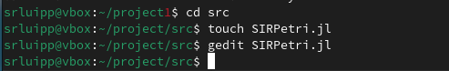
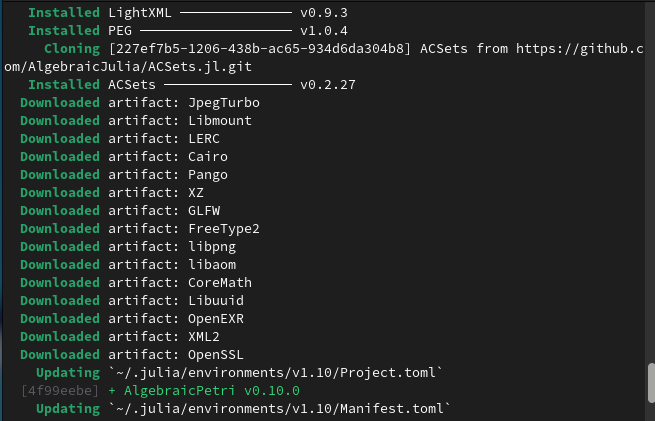
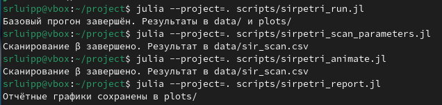
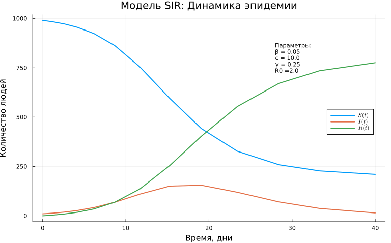

---
## Author
author:
  name: Люпп Софья Романовна
  degrees: Bachelor's
  orcid: 0000-0002-0877-7063
  email: 1132236039@rudn.ru
  affiliation:
    - name: Российский университет дружбы народов
      country: Российская Федерация
      postal-code: 117198
      city: Москва
      address: ул. Миклухо-Маклая, д. 6

## Title
title: "Лабораторная работа №6"
subtitle: "Реализация основных моделей в подходе сетей Петри"
license: "CC BY"
---

# Цель работы

Изучить и реализовать основные модели в подходе сетей Петри

# Задание

1) Изучить теорию по аппарату сетей Петри;
2) Создать необходимые скрипты по заданию;
3) Выполнить отчет и презентацию, преобразовать документацию в формате Quarto и выполнить литературный код.

# Теоретическое введение

Реализована модель эпидемии SIR (Susceptible–Infectious–Recovered) с использованием сетей Петри. Модель описывает переходы между тремя состояниями:
— 𝑆 (восприимчивые) — могут заразиться;
— 𝐼 (инфицированные) — заражают других и выздоравливают;
— 𝑅 (выздоровевшие / с иммунитетом) — больше не участвуют в эпидемии.

Сеть Петри содержит два перехода:
— infection: 𝑆 + 𝐼 → 𝐼 + 𝐼 (скорость β);
— recovery: 𝐼 → 𝑅 (скорость γ).

# Выполнение лабораторной работы

Начинаю лабораторную с главного скрипта, где будет реализована вычислительная логика модели ([рис. @fig-001]).

{#fig-001 width=70%}

Создаю скрипты, которые: 1) выполняет один базовый эксперимент с фиксированными параметрами β = 0.3, γ = 0.1 и запускает два типа симуляции: детерминированную (решение ОДУ) — даёт плавную усреднённую динамику и стохастическую (алгоритм Гиллеспи), которая учитывает случайные флуктуации (файл sirpetri_run.jl);

2) файл sirpetri_scan_parameters.jl, где исследуется чувствительность модели к изменению параметра β, для каждого из которых запускается детерминированная симуляция. Также для каждого прогона вычисляются: максимальное число инфицированных (пик эпидемии) – peak_I и
конечное число выздоровевших – final_R;

3) файл sirpetri_animate.jl, который создаёт GIF-анимацию, показывающую, как со временем меняется количество людей в каждой из трёх групп (𝑆, 𝐼, 𝑅);

4) итоговый отчетный файл sirpetri_report.jl, который сравнивает детерминированную и стохастическую динамику инфицированных I(t), а также зависимость пика I от β (результат сканирования).

{#fig-002 width=70%}

Выполняю команду julia для скриптов, предварительно установив некоторые пакеты для julia ([рис. @fig-003]) ([рис. @fig-004]).

{#fig-003 width=70%}

{#fig-004 width=70%}

Получили динамику эпидемии модели SIR для всех групп ([рис. @fig-005]).

{#fig-005 width=70%}

Получаем график с двумя линиями: пик I(β) и конечное R(β), где исследуется чувствительность модели к изменению параметра β ([рис. @fig-006])

{#fig-006 width=70%}

Также в plot сохранилась анимация в формате gif, показывающая, как со временем меняется количество людей в каждой из трёх групп.

В отчетном графике выводим 1) два графика I(t) (детерминированный vs стохастический) на одной координатной плоскости ([рис. @fig-007])

{#fig-007 width=70%}

И выводим график peak_I(β) - максимальное число инфицированных (пик эпидемии) ([рис. @fig-008]).

{#fig-008 width=70%}





# Выводы

В ходе лабораторной работы я изучила и реализовала основные модели в подходе сетей Петри

# Список литературы{.unnumbered}

- Имитационное моделирование. Практикум
А. В. Королькова Кулябов Д. С.

::: {#refs}
:::
