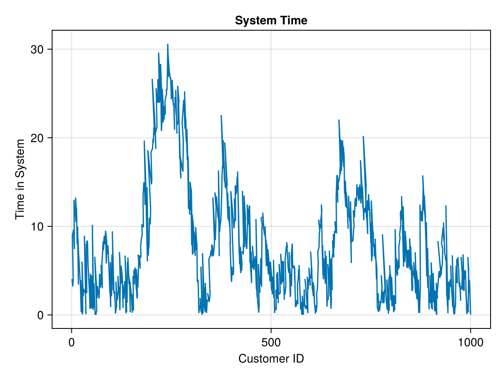
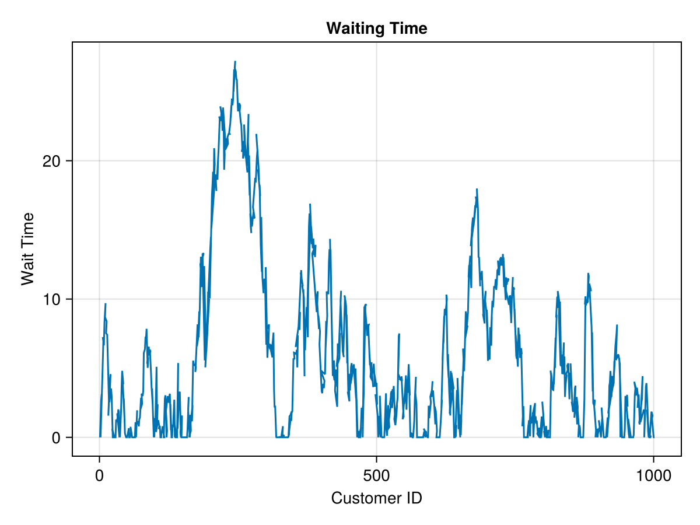
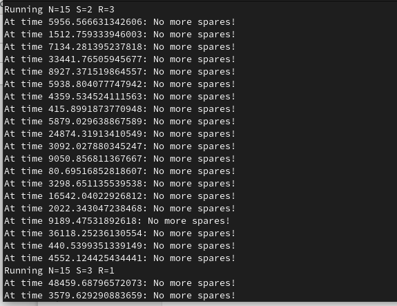
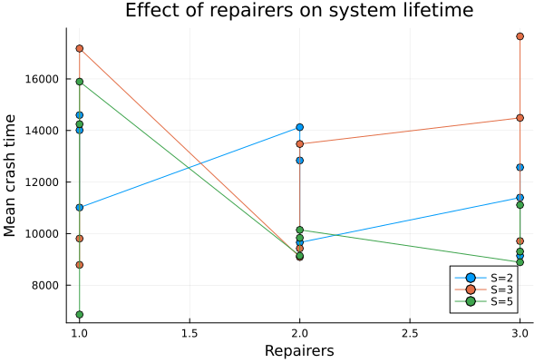
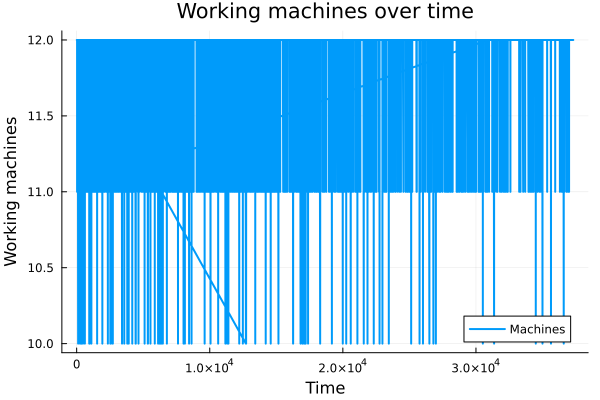
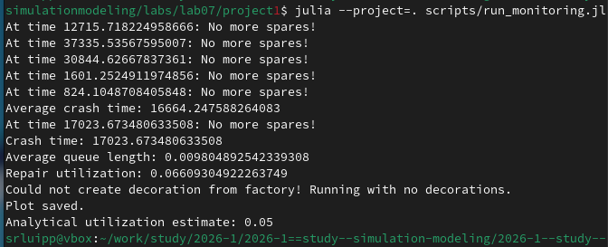

---
## Author
author:
  name: Люпп Софья Романовна
  degrees: Bachelor's
  orcid: 0000-0002-0877-7063
  email: kulyabov-ds@rudn.ru
  affiliation:
    - name: Российский университет дружбы народов
      country: Российская Федерация
      postal-code: 117198
      city: Москва
      address: ул. Миклухо-Маклая, д. 6
## Title
title: Презентация по лабораторной работе №5
subtitle: Аппарат сетей Петри
license: CC BY
date: today
date-format: "YYYY-MM-DD" # Example: 2025-09-06
---

# Информация

## Докладчик

:::::::::::::: {.columns align=center}
::: {.column width="70%"}

  * Люпп Софья Романовна
  * студентка НКНбд-01-23
  * кафедра теории вероятностей и кибербезопасности
  * Российский университет дружбы народов им. П. Лумумбы
  * 1132236039@rudn.ru
  * <https://github.com/srluipp>

:::
::: {.column width="30%"}

:::
::::::::::::::

# Вводная часть

## Актуальность

Модель Росса актуальна для анализа надёжности технических систем с резервированием и ремонтом, например серверов, производственных линий и телекоммуникационного оборудования, где важно оценить время до отказа системы.

Модели массового обслуживания широко применяются для исследования очередей и загрузки ресурсов в банках, компьютерных сетях, call-центрах и транспортных системах, позволяя оптимизировать число обслуживающих устройств и уменьшать время ожидания.

## Объект и предмет исследования

Объект исследования: дискретно-событийное моделирование
Предмет исследования: модель Росса

## Цели 

Изучить дискретно-событийное моделирование, модели М/М/С и модель Росса.

## Задачи

1) Изучить теорию по дискретно-событийному моделированию и модель Росса;
2) Создать необходимые скрипты по заданию;
3) Выполнить отчет и презентацию, преобразовать документацию в формате Quarto и выполнить литературный код.

## Материалы и методы

В качестве материалов к выполнению лабораторной работы была использована работа Имитационное моделирование. Практикум. (А. В. Королькова Кулябов Д. С.)

# Выполнение работы

Начинаю лабораторную с реализации модели М/М/С ([рис. @fig-001]).

{#fig-001 width=70%}

## run_simulation

Записываю скрипт run_simulation для модели М/М/2 с данными по заданию параметрами ([рис. @fig-002]).

{#fig-002 width=70%}

## Выводы в консоль

В консоль получаю вывод DataFrame с параметрами модели ([рис. @fig-003]).

{#fig-003 width=70%}

## График времени нахождения в системе
 
В plots появился график времени нахождения в системе ([рис. @fig-004])
 
{#fig-004 width=70%}

## График времени ожидания обслуживания

В plots появился график времени ожидания обслуживания ([рис. @fig-005]) 

{#fig-005 width=70%}

## Добавление нескольких машин в симуляцию

Добавляю нескольких ремонтников и делаю прогон для разного количества машин ([рис. @fig-006]).

{#fig-006 width=70%}

## График влияния параметра s

Делаю вывод о влиянии количества машин s на систему по получившемуся графику ([рис. @fig-007]).

{#fig-007 width=70%}

## Зависимость времени от числа ремонтников

График показывает зависимость среднего времени до отказа системы от числа ремонтников при разных количествах резервных машин S ([рис. @fig-008]).

{#fig-008 width=70%}

## Анализ 

Провожу мониторинг загрузки ремонтника, средней длины очереди на ремонт ([рис. @fig-009]).

{#fig-009 width=70%}

## Результаты

Результатами данной лабораторной работы являются получившиеся графики и анимация в plots

## Итоговый слайд

([рис. @fig-010]).

{#fig-010 width=70%}

:::
