---
## Author
author:
  name: Люпп Софья Романовна
  degrees: Bachelor's
  orcid: 0000-0002-0877-7063
  email: 1132236039@rudn.ru
  affiliation:
    - name: Российский университет дружбы народов
      country: Российская Федерация
      postal-code: 117198
      city: Москва
      address: ул. Миклухо-Маклая, д. 6

## Title
title: "Лабораторная работа №7"
subtitle: "Дискретно-событийное моделирование"
license: "CC BY"
---

# Цель работы

Изучить дискретно-событийное моделирование и реализовать модель Росса

# Задание

1) Изучить теорию по дискретно-событийному моделированию и модель Росса;
2) Создать необходимые скрипты по заданию;
3) Выполнить отчет и презентацию, преобразовать документацию в формате Quarto и выполнить литературный код.

# Теоретическое введение

Модель M/M/c (по классификации Кендалла) — это система массового обслуживания со следующими свойствами:
— M (Markovian) — входящий поток заявок пуассоновский, интервалы между прибытиями распределены экспоненциально с параметром λ.
— M — время обслуживания каждой заявки распределено экспоненциально с
параметром μ.
— c — количество идентичных обслуживающих приборов (каналов), работающих
параллельно.

Модель Росса же представляет собой классический пример системы массового обслуживания с конечной популяцией, резервом и ремонтом.

— В системе находятся 𝑁 идентичных машин, которые постоянно работают и
могут выходить из строя.
— 𝑆 машин находятся в резерве и готовы немедленно заменить любую отказавшую.
— Одно ремонтное устройство (ремонтник), которое может одновременно ремонтировать только одну машину.
— Когда работающая машина ломается, происходит следующее:
— Немедленно берётся одна резервная машина (если она есть) и запускается
в работу вместо сломавшейся.
— Сломанная машина отправляется в ремонт.
— Если резерва нет, система падает (crash). Моделирование заканчивается.
— После ремонта машина пополняет пул резервных (становится исправной и
ждёт).
— Требуется оценить среднее время до падения системы 𝐸[𝑇] при заданных
распределениях наработки до отказа и времени ремонта.

# Выполнение лабораторной работы

Начинаю лабораторную с главного скрипта, где будет реализована вычислительная логика модели М/М/С ([рис. @fig-001]).

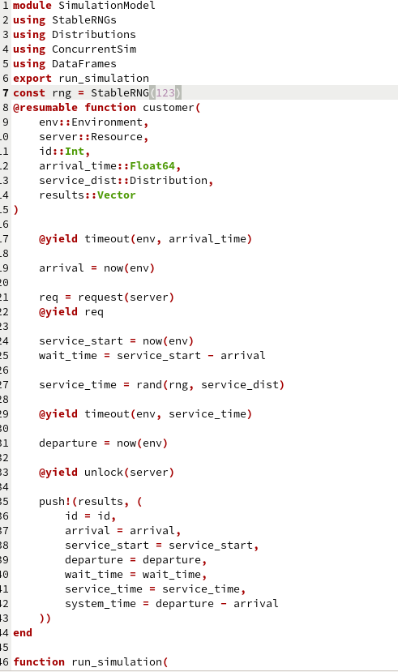{#fig-001 width=70%}

После чего в scripts создаю файл run_simulation.jl, который реализует модель с двумя обслуживающими приборами и с заданными интенсивностями обслуживания и прибытия ([рис. @fig-002]). Сохраняю графики в plots ([рис. @fig-003]).

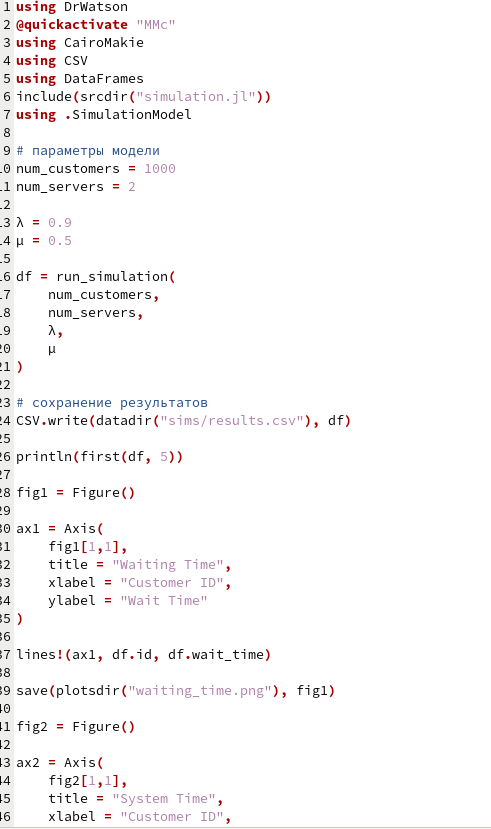{#fig-002 width=70%}

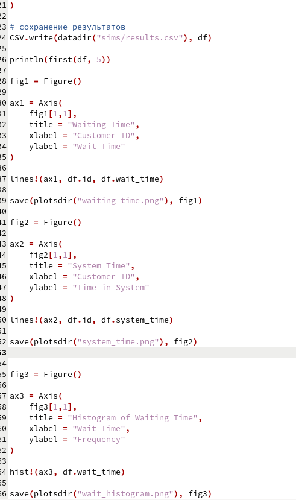{#fig-003 width=70%}

Для этого в Julia добавляю необходимые пакеты ([рис. @fig-004])  ([рис. @fig-005]) ([рис. @fig-006]) ([рис. @fig-007]).

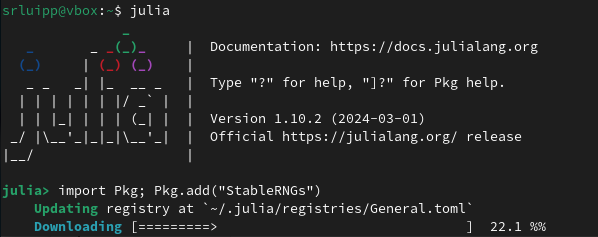{#fig-004 width=70%}

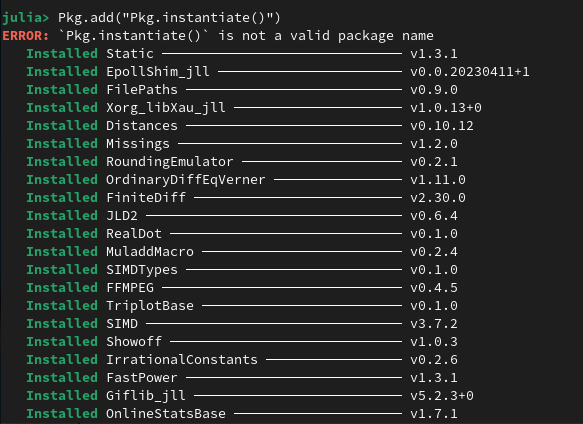{#fig-005 width=70%}

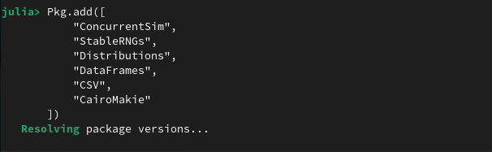{#fig-006 width=70%}

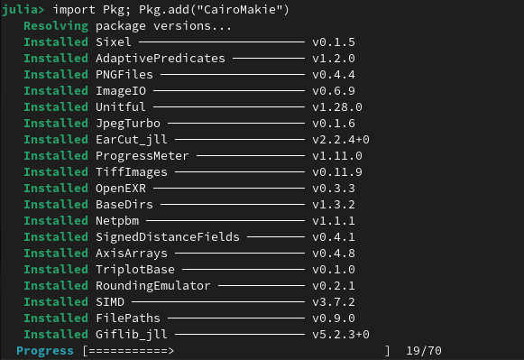{#fig-007 width=70%}

Вывод файла run_simulation.jl в консоль в формате DataFrame с параметрами модели ([рис. @fig-008]).

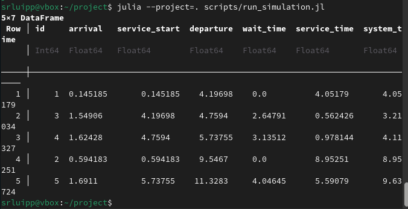{#fig-008 width=70%}

График времени, проведенного клиентом (заявкой) в системе ([рис. @fig-009]).

{#fig-009 width=70%}

График времени ожидания обслуживания ([рис. @fig-010]).

{#fig-010 width=70%}

График времени ожидания в формате гистограммы ([рис. @fig-011]).

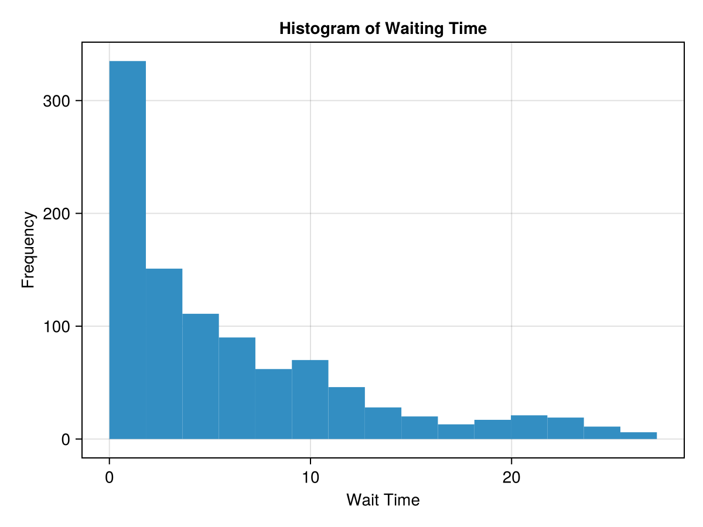{#fig-011 width=70%}

Пишу скрипт в src ([рис. @fig-012]) для реализации модели Росса и скрипт в scripts run_comparison.jl с параметрами модели по заданию ([рис. @fig-013]). Добавляю нескольких ремонтников и делаю прогон для разного количества машин ([рис. @fig-014]). Провожу мониторинг загрузки ремонтника, средней длины очереди на ремонт ([рис. @fig-015]). Строю график изменения числа исправных машин во времени и сравниваю с аналитическим решением ([рис. @fig-016]).

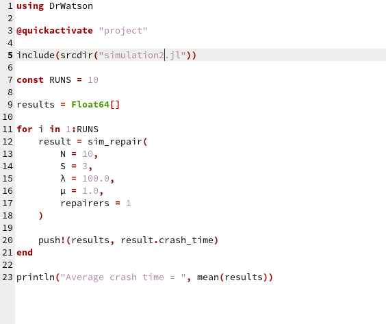{#fig-012 width=70%}

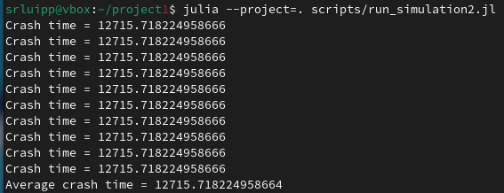{#fig-013 width=70%}

{#fig-014 width=70%}

{#fig-015 width=70%}

{#fig-016 width=70%}

# Выводы

В ходе лабораторной работы я изучила дискретно-событийное моделирование и реализовала модель Росса для задачи ремонтников.

# Список литературы{.unnumbered}

- Имитационное моделирование. Практикум
А. В. Королькова Кулябов Д. С.

::: {#refs}
:::
