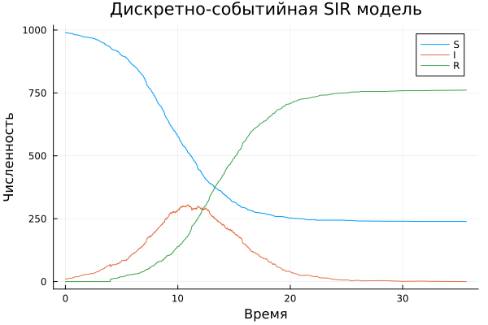
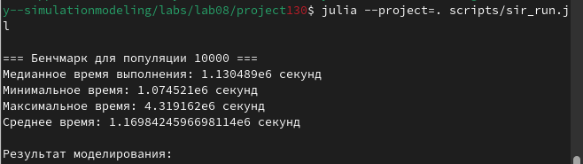
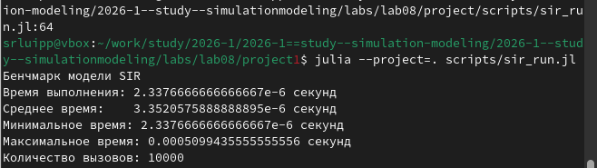
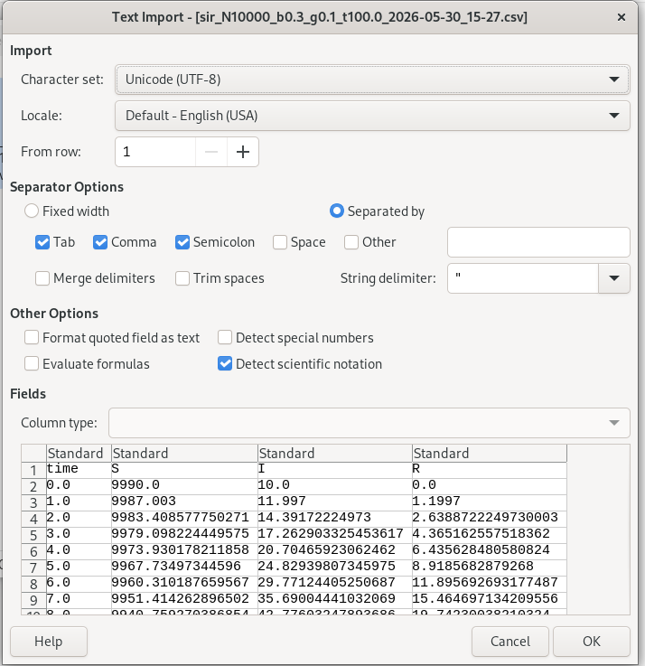
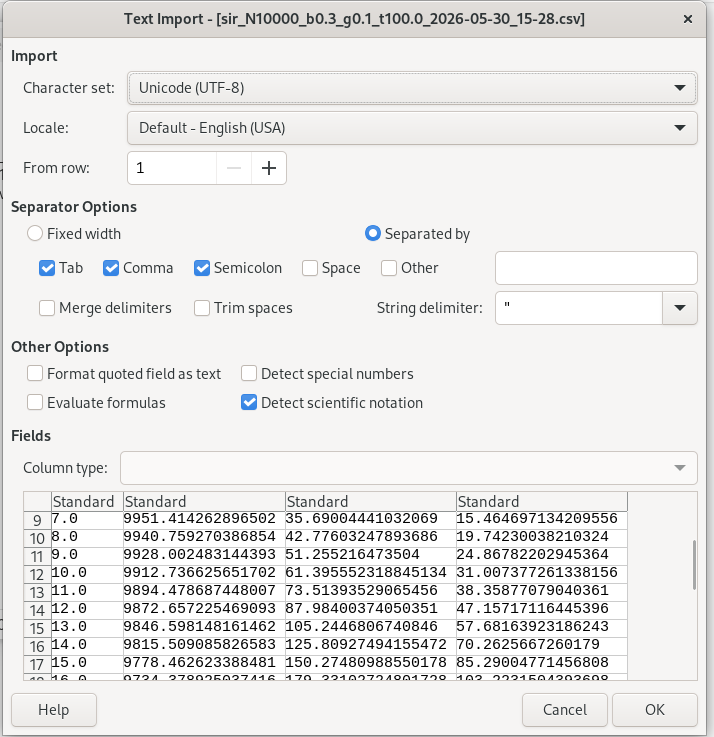
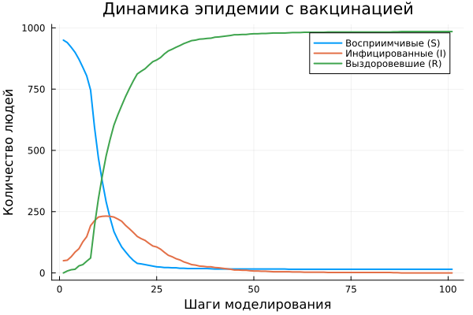
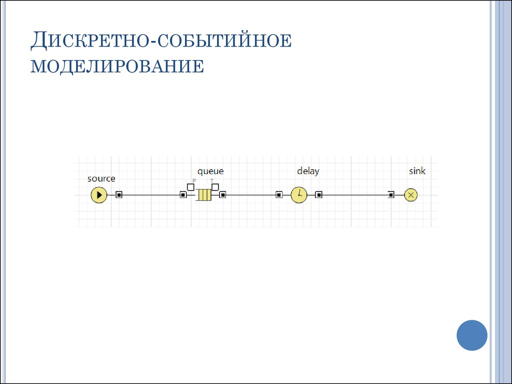

---
## Author
author:
  name: Люпп Софья Романовна
  degrees: Bachelor's
  orcid: 0000-0002-0877-7063
  email: 1132236039@rudn.ru
  affiliation:
    - name: Российский университет дружбы народов
      country: Российская Федерация
      postal-code: 117198
      city: Москва
      address: ул. Миклухо-Маклая, д. 6
## Title
title: Презентация по лабораторной работе №8
subtitle: Реализация основных моделей в дискретно-событийном подходе
license: CC BY
date: today
date-format: "YYYY-MM-DD" # Example: 2025-09-06
---

# Информация

## Докладчик

:::::::::::::: {.columns align=center}
::: {.column width="70%"}

  * Люпп Софья Романовна
  * студентка НКНбд-01-23
  * кафедра теории вероятностей и кибербезопасности
  * Российский университет дружбы народов им. П. Лумумбы
  * 1132236039@rudn.ru
  * <https://github.com/srluipp>

:::
::: {.column width="30%"}

:::
::::::::::::::

# Вводная часть

## Актуальность

Дискретно-событийный подход позволяет моделировать стохастические процессы с учетом случайности заражений, что важно для оценки рисков и планирования мер вмешательства для различных эпидемий, что особенно актуально после недавнего COVID-19

## Объект и предмет исследования

Объект исследования: дискретно-событийное моделирование
Предмет исследования: модель SIR

## Цели 

Изучить дискретно-событийный подход к имитационному моделированию на примере классической модели распространения инфекции SIR.

## Задачи

1) Изучить теорию по дискретно-событийному моделированию;
2) Создать необходимые скрипты по заданию;
3) Выполнить дополнительные задания;
3) Выполнить отчет и презентацию, преобразовать документацию в формате Quarto и выполнить литературный код.

## Материалы и методы

В качестве материалов к выполнению лабораторной работы была использована работа Имитационное моделирование. Практикум. (А. В. Королькова Кулябов Д. С.)

# Выполнение работы

Реализую модель sir_des.jl. Вывожу полученные результаты для всех трех групп инфецированных ([рис. @fig-001]).

{#fig-001 width=70%}

## Beta=0.03

Провожу анализ цикла, варьирующего параметры бета, получаю три результата для трех разных значений ([рис. @fig-002])

{#fig-002 width=70%}

## Beta=0.05

([рис. @fig-003]).
 
{#fig-003 width=70%}

## Beta=0.07

([рис. @fig-004]).

{#fig-004 width=70%}

## Замена времени выздоравления на 1/γ

Заменяю экспоненциальное время выздоровления на фиксированную величину 1/γ и получаю результаты для графика sir_des.jl  ([рис. @fig-005]).

{#fig-005 width=70%}

## График для бета=0.03 с величиной выздоравления 1/γ

([рис. @fig-006]).

{#fig-006 width=70%}

## График для бета=0.05 с величиной выздоравления 1/γ

([рис. @fig-007]).

{#fig-007 width=70%}

## График для бета=0.07 с величиной выздоравления 1/γ

([рис. @fig-008]).

{#fig-008 width=70%}

## Время выполнения sir_run для популяции 10000 индивидов

С помощью макроса @benchmark измеряю время выполнения sir_run ([рис. @fig-009]) 

{#fig-009 width=70%}

## Время выполнения sir_run для популяции 10000 индивидов
 
([рис. @fig-010]).

{#fig-010 width=70%}

## CVS-результаты

Сохраняю результаты в формате csv ([рис. @fig-011]) 

{#fig-011 width=70%}

## CVS-результаты

Сохраняю результаты в формате csv ([рис. @fig-012]) 

{#fig-012 width=70%}

## Модель SIR с демографией

Добавляю демографические события: расширяю модель, добавив в жизненный цикл индивида возможность смерти (с постоянной интенсивностью μ) и рождение новых восприимчивых ([рис. @fig-013]). 

{#fig-013 width=70%}

## Модель SIR с вакцинацией

В функцию live добавить блок ожидания смерти. Реализовываю стратегию вакцинации: в определённый момент времени (или при превышении порога инфицированных) часть восприимчивых мгновенно переводится в :R. Исследую, какая доля вакцинированных необходима для предотвращения эпидемии ([рис. @fig-014]) 

{#fig-014 width=70%}

## Анализ модели SIR с вакцинацией

([рис. @fig-015]).

{#fig-015 width=70%}

## Срабатывание события вакцинации по таймеру

Добавляю в модель срабатывание события вакцинации по таймеру ([рис. @fig-016]).

{#fig-016 width=70%}

## Латентный период

Ввожу латентный период (статус :E). После заражения индивид переходит в :E и через время, распределённое экспоненциально с параметром σ, становится инфекционным (:I) ([рис. @fig-017]).

{#fig-017 width=70%}

## Результаты

Результатами данной лабораторной работы являются получившиеся графики и анимация в plots

## Итоговый слайд

([рис. @fig-018]).

{#fig-018 width=70%}

