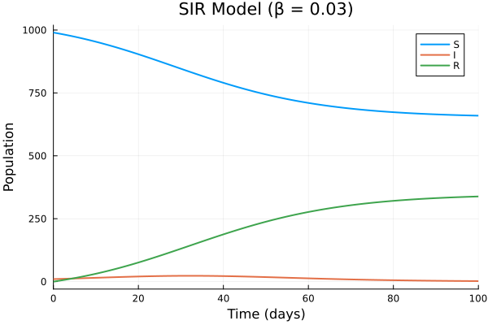
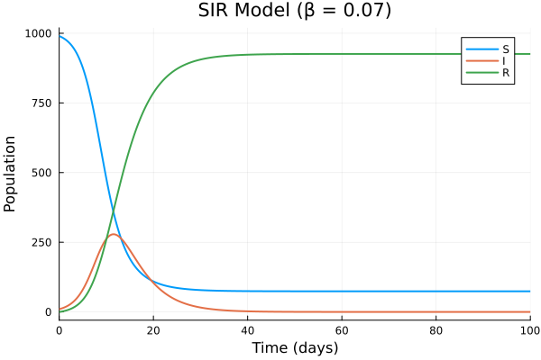
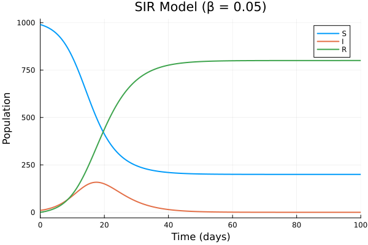
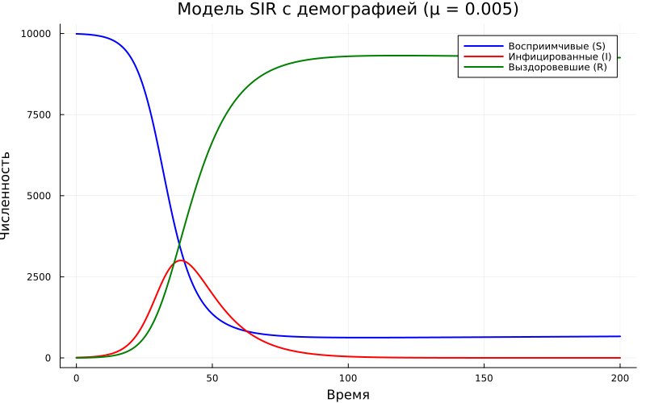
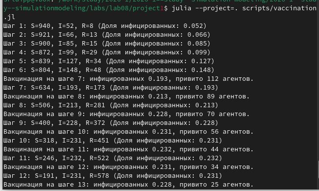
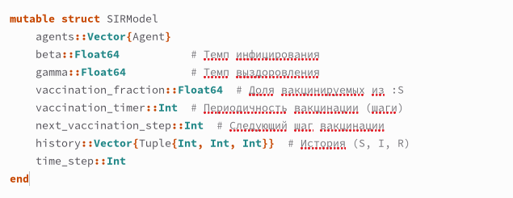
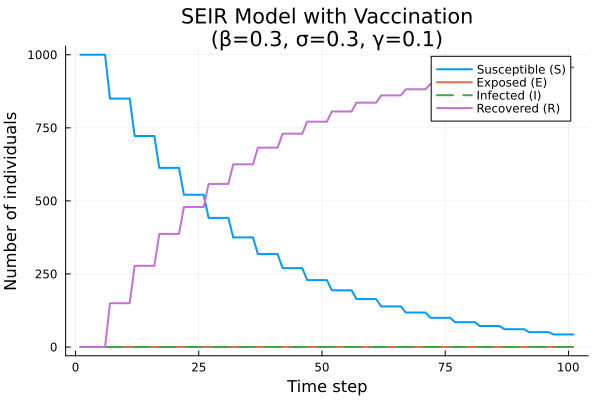

---
## Author
author:
  name: Люпп Софья Романовна
  degrees: Bachelor's
  orcid: 0000-0002-0877-7063
  email: 1132236039@rudn.ru
  affiliation:
    - name: Российский университет дружбы народов
      country: Российская Федерация
      postal-code: 117198
      city: Москва
      address: ул. Миклухо-Маклая, д. 6

## Title
title: "Лабораторная работа №8"
subtitle: "Реализация основных моделей в дискретно-событийном подходе"
license: "CC BY"
---

# Цель работы

Изучить дискретно-событийный подход к имитационному моделированию на
примере классической модели распространения инфекции SIR.

# Задание

1) Изучить теорию по дискретно-событийному моделированию;
2) Создать необходимые скрипты по заданию;
3) Выполнить дополнительные задания;
3) Выполнить отчет и презентацию, преобразовать документацию в формате Quarto и выполнить литературный код.

# Теоретическое введение

Программный комплекс состоит из двух основных файлов:
— src/sir_model.jl (ядро модели): определение структур данных, функций событий, логики агентов и управления симуляцией.
— scripts/sir_des.jl (скрипт запуска): задание параметров, инициализация
модели, выполнение прогона и визуализация.

Используемые внешние библиотеки
— ResumableFunctions: создание возобновляемых функций-генераторов с помощью макроса @resumable и оператора @yield.
— ConcurrentSim: ядро дискретно-событийного моделирования: управление
виртуальным временем, планирование событий через timeout и запуск процессов через @process.
— Distributions: генерация случайных величин (экспоненциальное, дискретное равномерное, равномерное распределения).
— DataFrames: формирование таблицы результатов.
— StatsPlots: построение графиков.

Вспомогательные функции мутации массивов статистики
— increment!(a::Array{Int64}) — добавляет в конец массива значение, увеличенное на 1 относительно последнего элемента.
— decrement!(a::Array{Int64}) — добавляет значение, уменьшенное на 1.
— carryover!(a::Array{Int64}) — дублирует последнее значение.
Эти функции используются для фиксации изменений численности S, I, R в момент
наступления события. Массивы Sa, Ia, Ra хранят временные ряды численности:
каждая операция добавляет новую точку, соответствующую текущему модельно
времени.

Функция live описывает жизненный цикл индивида. Она размечена макросом
@resumable, что позволяет приостанавливать её выполнение с помощью @yield
timeout(...), не блокируя поток.
Логика работы:
— Пока индивид находится в состоянии :S:
— Ожидает случайное время, распределённое экспоненциально с параметром
1/c. Это моделирует промежуток до следующего социального контакта.
— После ожидания выбирает случайного собеседника (alter) из всей популяции (исключая себя).
— Если собеседник в состоянии :I, то с вероятностью β происходит заражение:
статус меняется на :I и вызывается infection_update!.
— Если индивид стал инфицированным (:I):
— Ожидает время до выздоровления, распределённое экспоненциально с
параметром 1/γ.
— После этого статус меняется на :R, и вызывается recovery_update!.

# Выполнение лабораторной работы

Начинаю лабораторную с главного скрипта, где будет реализована вычислительная логика модели SIR в src, а затем делаю скрипт в scripts sir_des.jl. Вывожу полученные результаты ([рис. @fig-001]).

{#fig-001 width=70%}

После этого хочу проанализировать цикл, варьирующий параметры бета, получаю три результата для трех разных значений ([рис. @fig-002]) ([рис. @fig-003]) ([рис. @fig-004]) .

{#fig-002 width=70%}

{#fig-003 width=70%}

{#fig-004 width=70%}

Заменяю экспоненциальное время выздоровления на фиксированную величину 1/γ и получаю результаты для графиков sir_des.jl и графиков с различными значениями бета и обращаю внимание на более синхронное выздоровление ([рис. @fig-005]) ([рис. @fig-006]) ([рис. @fig-007]) ([рис. @fig-008]).

{#fig-005 width=70%}

{#fig-006 width=70%}

{#fig-007 width=70%}

{#fig-008 width=70%}

С помощью макроса @benchmark измеряю время выполнения sir_run для популяции 10000 индивидов с определенным способом оптимизации. Полученные результаты отображены в консоль ([рис. @fig-009]) ([рис. @fig-010]).
 
{#fig-009 width=70%}

{#fig-010 width=70%}

Сохраняю результаты в формате csv ([рис. @fig-011]) ([рис. @fig-012]).

{#fig-011 width=70%}

{#fig-012 width=70%}

После чего по заданию добавляю демографические события: расширяю модель, добавив в жизненный цикл индивида возможность смерти (с постоянной интенсивностью μ) и рождение новых восприимчивых. Вывожу график ([рис. @fig-013]). 

{#fig-013 width=70%}

В функцию live добавить блок ожидания смерти. Реализовываю стратегию вакцинации: в определённый момент времени (или при превышении порога инфицированных) часть восприимчивых мгновенно переводится в :R. Исследую, какая доля вакцинированных необходима для предотвращения эпидемии ([рис. @fig-014]) ([рис. @fig-015]).

{#fig-014 width=70%}

{#fig-015 width=70%}

Добавляю в модель срабатывание события вакцинации по таймеру ([рис. @fig-016]).

{#fig-016 width=70%}

Ввожу латентный период (статус :E). После заражения индивид переходит в :E и через время, распределённое экспоненциально с параметром σ, становится инфекционным (:I). Оцениваю, как меняется динамика по сравнению с SIR ([рис. @fig-017]).

{#fig-017 width=70%}

# Выводы

В ходе лабораторной работы я изучила и реализовала основные модели в дискретно-событийном подходе (модель SiR)

# Список литературы{.unnumbered}

- Имитационное моделирование. Практикум
А. В. Королькова Кулябов Д. С.

::: {#refs}
:::
